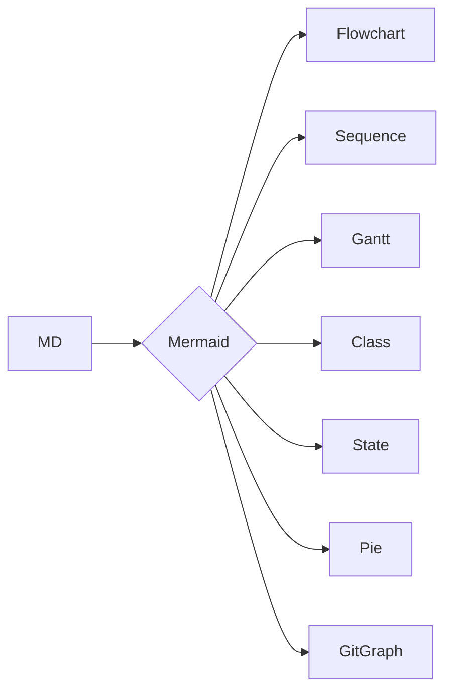
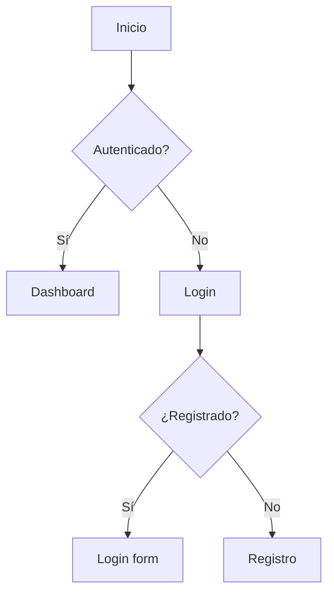
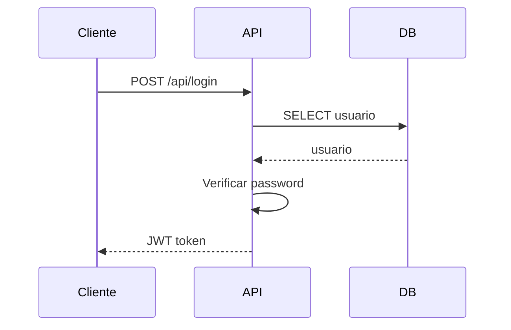
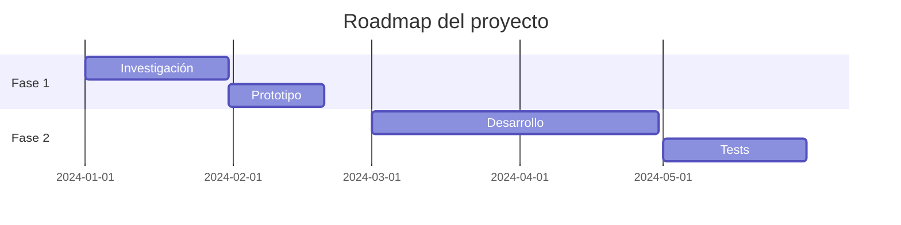
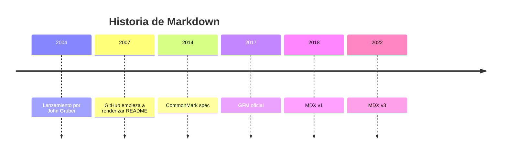
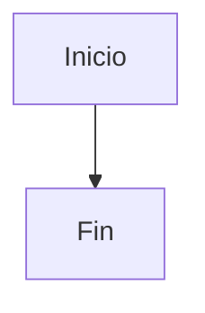
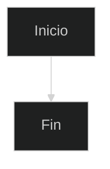

# Guía de Markdown y MDX: De 0 a 100

## ¿Qué es Markdown?

Markdown es un lenguaje de marcado ligero creado por **John Gruber** (Daring Fireball) con contribuciones de **Aaron Swartz** en 2004. Su objetivo fue diseñar un formato que fuera tan legible en texto plano como en su versión renderizada. La filosofía central: **la legibilidad es lo primero**. Un archivo Markdown debe entenderse incluso antes de ser procesado.

**¿Dónde se usa?**
- **Documentación técnica**: README, wikis, docs de API — estándar en GitHub, GitLab, Bitbucket
- **Blogging y CMS**: Astro, Next.js, Gatsby, Ghost, Wordpress (plugin) — contenido como MDX
- **Notas personales**: Obsidian, Logseq, Notion, Roam Research, Foam
- **Libros y papers**: Pandoc convierte MD a PDF, EPUB, LaTeX, DOCX
- **Mensajería**: Slack, Discord, Telegram, WhatsApp (soporte parcial)
- **Ciencia de datos**: Jupyter Notebooks con celdas Markdown, Quarto, RMarkdown
- **Presentaciones**: Slidev, Marp, reveal.js con Markdown

**¿Quién lo usa?** GitHub (todos los README/issues/discussions), Stack Overflow (cuerpo de preguntas y respuestas), Reddit (comentarios con formato), Discord/Slack (mensajes formateados), Obsidian (millones de usuarios tomando notas).

**¿Cómo ha evolucionado?**
- **2004**: John Gruber publica Markdown.pl, el parser original en Perl
- **2007**: GitHub empieza a renderizar README.md — explosión de adopción
- **2012**: Lanzamiento de Pandoc, el "swiss-army knife" de conversión de documentos
- **2014**: CommonMark — especificación estandarizada para acabar con las dialectos incompatibles
- **2017**: GFM (GitHub Flavored Markdown) — tablas, tachado, task lists
- **2018**: MDX en tiempo de compilación con mdx-js/mdx
- **2020**: MDX v2 con sintaxis más estricta y mejor rendimiento
- **2022**: MDX v3 con ESM-only, soporte completo de JSX
- **2024–2026**: MDX embebido en frameworks (Astro, Next.js), CMS headless con Tina CMS, observabilidad

Fuente: [Daring Fireball — Markdown](https://daringfireball.net/projects/markdown/), [CommonMark spec](https://spec.commonmark.org/), [GitHub Flavored Markdown](https://github.github.com/gfm/), [MDX docs](https://mdxjs.com/)

---

## Instalación

### Markdown no necesita instalación

Markdown es texto plano. Cualquier editor de texto abre archivos `.md` o `.mdx`. No hay runtime, compilador ni dependencias para *escribir* Markdown.

Para *procesarlo* (convertir a HTML, PDF, etc.) sí necesitas herramientas, pero el formato en sí es cero-dependencia.

### Editores recomendados

| Editor | Tipo | Para qué destaca |
|---|---|---|
| **VS Code** | Editor de código | Extensiones (Markdown All in One, markdownlint, MDX), vista previa en vivo, snippets |
| **Obsidian** | Notas personales | Graph view, backlinks, plugins, Canvas, conocimiento interconectado |
| **Typora** | WYSIWYG | Edición en vivo sin mostrar sintaxis — lo que ves es lo que obtienes |
| **Zettlr** | Académico | Citas Zotero, LaTeX, exportación con Pandoc integrado |
| **iA Writer** | Escritura limpia | Modo foco, sintaxis resaltada en gris, themes minimalistas |
| **StackEdit** | Web | Sincronización con Google Drive/Dropbox, publicación directa a Blogger/WordPress |
| **Neovim** | Editor de terminal | `markdown-preview.nvim`, `markdownlint`, snippets con LuaSnip |
| **Emacs** | Editor extensible | `markdown-mode`, `pandoc-mode`, `org-mode` exporta a MD |
| **Logseq** | Notas outliner | Bloques, backlinks, propiedades, organización en grafos |
| **Foam** | Notas en VS Code | Knowledge base con backlinks, graph, tag explorer |

### Configuración en VS Code

Extensiones mínimas para trabajar con MD/MDX:

```bash
# Instalar desde CLI
code --install-extension yzhang.markdown-all-in-one
code --install-extension davidanson.vscode-markdownlint
code --install-extension unifiedjs.vscode-mdx
code --install-extension bierner.markdown-mermaid
code --install-extension bierner.markdown-preview-github-styles
```

```jsonc
// .vscode/settings.json
{
  "editor.wordWrap": "on",
  "editor.quickSuggestions": {
    "comments": "on",
    "strings": "on",
    "other": "on"
  },
  "[markdown]": {
    "editor.defaultFormatter": "yzhang.markdown-all-in-one",
    "editor.formatOnSave": true
  },
  "markdown.preview.breaks": true,        // Respetar saltos de línea
  "markdownlint.config": {
    "MD013": false,                        // Desactivar límite de línea
    "MD033": false                         // Permitir HTML inline
  }
}
```

### Alias útiles para el día a día

Añade a tu `~/.bashrc` o `~/.zshrc`:

```bash
alias md2pdf='pandoc -s -o output.pdf'
alias md2docx='pandoc -s -o output.docx'
alias md2epub='pandoc -s -o output.epub'
alias mdlint='npx markdownlint-cli2 "**/*.md" "#node_modules"'
alias mdwatch='npx live-server . --open=README.md'
alias mdpreview='grip README.md'  # Vista previa estilo GitHub
```

Fuente: [VS Code Markdown extension](https://code.visualstudio.com/docs/languages/markdown), [Obsidian docs](https://help.obsidian.md/), [Typora support](https://support.typora.io/)

---

## Primeros pasos

### El archivo `.md`

Cualquier archivo con extensión `.md` o `.markdown` es un documento Markdown. Ábrelo en cualquier editor y escribe:

```markdown
# Mi primer documento

Esto es un **párrafo** con *formato* básico.

- Una lista
- Con elementos
```

Guárdalo como `prueba.md`. En VS Code, presiona `Ctrl+K V` para abrir la vista previa. También `Ctrl+Shift+P → Markdown: Open Preview`.

### Estructura de un post MDX (Astro)

```markdown
---
title: "Mi artículo"
pubDate: 2024-06-28
tags: ["markdown", "tutorial"]
image: "img/portada.webp"
author: "Tu Nombre"
---

import Componente from '../Componente.astro';

# {frontmatter.title}

Contenido del artículo...

<Componente prop="valor" />

---

## Paradigmas

Markdown no es un lenguaje de programación, sino un lenguaje de marcado. Por eso sus paradigmas son distintos:

**Declarativo**: describes qué quieres ver, no cómo renderizarlo. Escribes `# Título` y el procesador decide si es un `<h1>` con tal fuente, color o tamaño. Tú solo declaras la intención.

**Lineal**: el flujo del documento es de arriba abajo. No hay saltos de ejecución, llamadas a funciones, ni bucles. Lo que escribes primero se renderiza primero.

**Markup**: anotas texto plano con sintaxis legible. El formato es parte del texto, no invisible como en un editor WYSIWYG. La filosofía: el texto debe ser legible incluso sin renderizar.

**No es programático**: Markdown puro no tiene lógica, variables, ni control de flujo. No puedes hacer `if (condicion)` ni `for elemento in lista`. Es un lenguaje de marcado, no de programación.

**MDX añade paradigma componente-based**: al combinar Markdown con JSX, introduces componentes reutilizables. El contenido sigue siendo declarativo, pero ahora puedes importar y anidar componentes como bloques de construcción.

---

## Tipos de datos y variables

Markdown en sí mismo no tiene tipos de datos ni variables. No hay `string`, `number`, `boolean` ni forma de declarar una variable reutilizable. Sin embargo, el ecosistema alrededor de Markdown sí los ofrece:

**YAML Frontmatter**: el bloque de metadatos entre `---` soporta varios tipos:

```yaml
---
title: "Mi documento"          # string
pubDate: 2024-06-28            # date
tags: ["md", "tutorial"]       # array
draft: false                   # boolean
rating: 4.5                    # number
author:
  name: Jorge                  # nested object
  email: jorge@ejemplo.com
---
```

**MDX: export/import**: en archivos `.mdx` puedes importar y usar variables JS/TS:

```markdown
import { siteTitle, formatDate } from '../utils';
import { datos } from '../data.json';

# {siteTitle}

Fecha: {formatDate(new Date())}
Total: {datos.length} artículos
```

**Variables de template en SSGs**: Hugo, 11ty y Jekyll ofrecen variables de plantilla:

```markdown
<!-- Hugo -->
{{ .Title }} — {{ .Date }}
{{ range .Pages }} - {{ .Title }} {{ end }}

<!-- 11ty / Nunjucks -->
{{ title }} — {{ page.date | readableDate }}

<!-- Jekyll / Liquid -->
{{ page.title }} — {{ page.date | date: "%Y-%m-%d" }}
```

**En MDX con layouts**: las props del layout y `defineVars` permiten pasar datos estructurados al contenido. El frontmatter se expone como objeto `frontmatter` en Astro.

**En herramientas**: Obsidian Dataview trata el frontmatter como campos de una base de datos consultables con DQL (Dataview Query Language):

```markdown
TABLE title, rating, date
FROM "posts"
WHERE rating > 4
SORT date DESC
```

---

## Control de flujo y modularidad

**Markdown puro no tiene control de flujo**. No existen `if`, `else`, `for`, `while` ni ninguna estructura de control. Es intencional: Markdown es para escribir contenido, no lógica.

**MDX introduce control de flujo mediante expresiones JSX**:

```markdown
{condition && <p>Esto se muestra si condition es true</p>}

{items.length > 0 ? (
  <ul>{items.map(item => <li key={item}>{item}</li>)}</ul>
) : (
  <p>No hay elementos</p>
)}

{items.map(item => (
  <div class="card" key={item.id}>
    <h3>{item.title}</h3>
    <p>{item.description}</p>
  </div>
))}
```

**Includes y composición**:

En MDX se hace con `import` de componentes:

```markdown
import Header from '../components/Header.astro';
import Sidebar from '../components/Sidebar.astro';
import Footer from '../components/Footer.astro';

<Header />
<Sidebar />
Contenido principal...
<Footer />
```

En otras herramientas:

| Herramienta | Mecanismo | Sintaxis |
|---|---|---|
| **Docfx** | Include | `` |
| **Hugo** | Partials | `{{ partial "header.html" . }}` |
| **Jekyll** | Includes | `` |
| **11ty** | Shortcodes | `` |
| **Pandoc** | Include | `!include file.md` |
| **Markdown** puro | Reference links | No hay — usa concatenación manual |

**Modularidad**: los documentos Markdown se organizan como archivos independientes:

```
docs/
├── index.md
├── instalacion.md
├── guia-uso/
│   ├── inicio-rapido.md
│   ├── configuracion.md
│   └── ejemplos.md
└── referencia/
    ├── api.md
    └── faq.md
```

Los Static Site Generators (Astro, Hugo, Jekyll) leen esta estructura de carpetas y generan rutas automáticas. Los layouts permiten herencia de plantillas: un layout general envuelve todas las páginas, layouts específicos para secciones, y componentes para piezas reutilizables.

---

## Conceptos clave explicados a fondo

### Encabezados

Los encabezados se crean con `#` del 1 al 6. Un espacio obligatorio entre `#` y el texto.

```markdown
# H1 — Título principal

---

## Sistema de archivos

Markdown se organiza en archivos de texto plano con extensión `.md` o `.mdx`. Un proyecto de documentación es simplemente una jerarquía de carpetas y archivos.

**Estructura típica**:

```
proyecto/
├── README.md
├── docs/
│   ├── index.md
│   ├── guia.md
│   └── api/
│       ├── autenticacion.md
│       └── endpoints.md
├── src/
│   └── content/
│       ├── posts/
│       │   ├── post-1.md
│       │   └── post-2.md
│       └── config.ts
└── package.json
```

**Herramientas de conocimiento interconectado**:

- **Obsidian**: bóveda de archivos `.md` con graph view, backlinks, Canvas. El plugin Dataview trata los archivos como una base de datos consultable.
- **Foam**: extensión de VS Code que aporta graph view, backlinks y generación automática de reference links.
- **Logseq**: organiza el conocimiento en bloques dentro de archivos `.md`, con propiedades, backlinks y salida en grafo.

**Frontmatter como metadatos**: cada archivo puede llevar metadatos YAML/TOML/JSON al inicio. Estos metadatos alimentan búsquedas, filtros, ordenación y renderizado condicional.

**Git como sistema de versionado**: al ser texto plano, los archivos Markdown se benefician de todo el ecosistema Git: diff, blame, branch, PR review. Un cambio en una línea se ve exactamente qué se modificó.

**Static Site Generators**:

| Framework | Fuente de contenido | Routing |
|---|---|---|
| **Astro** | `src/content/**/*.md` | Basado en carpetas + slug |
| **Next.js** | `content/` o `_posts/` | `getStaticPaths` + frontmatter |
| **Hugo** | `content/` | Jerarquía de carpetas |
| **Jekyll** | `_posts/` con naming `YYYY-MM-DD-titulo.md` | Fecha + slug |
| **Docusaurus** | `docs/` | Jerarquía + sidebars |

**Globbing para colecciones**: los frameworks usan patrones glob para seleccionar archivos:

```js
// Astro content config
const posts = defineCollection({
  loader: glob({ pattern: "**/*.{md,mdx}", base: "./src/content/posts" }),
  schema: z.object({
    title: z.string(),
    pubDate: z.date(),
    tags: z.array(z.string()),
  }),
});
```

**Obsidian Dataview**: trata los archivos `.md` como registros de base de datos:

```markdown
TABLE title, rating, date
FROM "projects"
WHERE status = "active"
SORT rating DESC
```

---

## Algoritmos

Markdown como lenguaje de marcado no ejecuta algoritmos computacionales. Sin embargo, en el ecosistema de procesamiento de Markdown existen conceptos análogos:

**Ordenación**: los posts/documentos se ordenan por fecha, título, o campo de frontmatter:

```js
posts.sort((a, b) => new Date(b.pubDate) - new Date(a.pubDate));
```

**Filtrado**: por tags, categorías, estado (draft/published), autor:

```js
const postsPublicados = posts.filter(p => !p.frontmatter.draft);
const postsTag = posts.filter(p => p.frontmatter.tags.includes("markdown"));
```

**Búsqueda de texto completo**: Pagefind, lunr.js y Algolia indexan el contenido para búsqueda:

```js
// lunr.js
const idx = lunr(function () {
  this.field('title', { boost: 10 });
  this.field('content');
  documentos.forEach(d => this.add(d));
});
const resultados = idx.search('markdown guía');
```

**Indexación**: Pagefind genera un índice de búsqueda a partir del HTML renderizado:

```bash
npx pagefind --site dist
```

**Graph traversal**: Obsidian y Foam construyen un grafo de documentos donde los nodos son archivos y las aristas son backlinks. El algoritmo recorre las conexiones para mostrar el grafo y sugerir documentos relacionados.

**Topological sort**: en wikis con dependencias entre documentos, se necesita ordenar topológicamente para determinar qué página renderizar primero o cómo construir el grafo acíclico de referencias.

**Generación de TOC**: los procesadores extraen encabezados con regex o recorriendo el AST para generar una tabla de contenidos automática:

```js
// Ejemplo conceptual
function generarTOC(markdown) {
  const headings = markdown.match(/^#{1,6}\s.+/gm);
  return headings.map(h => ({
    level: h.match(/^#+/)[0].length,
    text: h.replace(/^#+\s/, ''),
    slug: h.toLowerCase().replace(/[^\w]+/g, '-'),
  }));
}
```

**Paginación**: dividir listas de documentos en páginas:

```js
const docsPorPagina = 10;
const numPaginas = Math.ceil(totalDocs / docsPorPagina);
const docsPagina = docs.slice((pagina - 1) * docsPorPagina, pagina * docsPorPagina);
```

---

## Multimedia

Markdown maneja multimedia principalmente a través de sintaxis de imagen y HTML embebido.

**Imágenes**:

```markdown


```

Control de tamaño con HTML:

```html

```

Figure con figcaption:

```html
<figure>
  
  <figcaption>Diagrama de arquitectura del sistema</figcaption>
</figure>
```

SVG inline: funciona directamente en HTML dentro de Markdown.

**Video**:

HTML5 `<video>` embebido:

```html
<video width="100%" controls poster="portada.jpg">
  <source src="video.mp4" type="video/mp4" />
  <source src="video.webm" type="video/webm" />
  Tu navegador no soporta video HTML5.
</video>
```

YouTube/iframe:

```html
<iframe width="560" height="315" src="https://www.youtube.com/embed/dQw4w9WgXcQ"
  title="YouTube video" frameborder="0" allowfullscreen loading="lazy"></iframe>
```

En MDX, mejor con componentes:

```markdown
import YouTube from '../components/YouTube.astro';
<YouTube id="dQw4w9WgXcQ" />
```

**Audio**:

```html
<audio controls>
  <source src="podcast.mp3" type="audio/mpeg" />
  <source src="podcast.ogg" type="audio/ogg" />
  Tu navegador no soporta audio.
</audio>
```

Podcast RSS: los feeds RSS de podcasts referencian archivos de audio en enclosures `<enclosure url="audio.mp3" type="audio/mpeg" length="12345" />`.

**GIF**: las imágenes animadas GIF funcionan con la sintaxis estándar de imagen:

```markdown

```

**Tablas**:

Pipe tables (GFM):

```markdown
| Formato | Soporte nativo |
|---------|:--------------:|
| PNG     | ✅             |
| GIF     | ✅             |
| SVG     | ✅ (inline HTML) |
| MP4     | ❌ (usar video) |
```

HTML tables para casos complejos con colspan/rowspan.

**Gráficos y diagramas**:

Mermaid: bloques de código con lenguaje `mermaid`:



PlantUML: alternativa a Mermaid, requiere plugin de renderizado.

**Ecuaciones matemáticas** con MathJax/KaTeX:

```markdown
$$E = mc^2$$
```

**Gráficos interactivos**: en MDX puedes usar Chart.js o D3 dentro de componentes:

```markdown
import Chart from '../components/Chart.astro';
<Chart type="bar" data={datos} />
```

**Emojis**: shortcodes `:emoji:` en GFM y `remark-emoji`:

```markdown
:rocket: :warning: :fire: :sparkles: :memo:
```

**Diagramas ASCII**: en bloques de código sin lenguaje:

```markdown
    \u250c\u2500\u2500\u2500\u2500\u2510
    \u2502 Input\u2502
    \u2514\u2500\u2500\u252c\u2500\u2500\u2518
       \u25bc
    \u250c\u2500\u2500\u2500\u2500\u2510
    \u2502 Proceso\u2502
    \u2514\u2500\u2500\u252c\u2500\u2500\u2518
       \u25bc
    \u250c\u2500\u2500\u2500\u2500\u2510
    \u2502 Output\u2502
    \u2514\u2500\u2500\u2500\u2500\u2518
```

---

## BD y gestión del conocimiento

### Obsidian como base de conocimiento

Obsidian convierte una carpeta de archivos Markdown en una base de conocimiento interconectada:

```markdown
# Arquitectura del sistema

- Referencia a [[ADR-001-astro]]
- Concepto relacionado: [[microservicios]]
- Ver también: [[diagrama-arquitectura]]

Tags: #arquitectura #backend #documentación
```

**Características clave:**
- **Backlinks**: cada archivo muestra qué otros archivos lo referencian
- **Graph view**: visualización de todas las conexiones entre notas
- **Plugins**: Canvas (diagramas), Dataview (consultas tipo SQL sobre notas), Templater (plantillas)
- **Properties**: metadatos YAML al inicio de cada nota
- **Canvas**: lienzo visual con notas, imágenes y conectores

### Foam (VS Code)

Foam lleva el concepto de Obsidian a VS Code:

```markdown
# Título

- Enlace a [[otra-nota]]
- Tag: #concepto

[//begin]: # "Autogenerated link references"
[otra-nota]: otra-nota.md "Otra Nota"
[//end]: # "Autogenerated link references"
```

Foam genera automáticamente los reference links para backlinks y mantiene un grafo de conocimiento navegable.

### Dendron

Dendron estructura las notas jerárquicamente:

```
docs/
├── root.md
├── project.name.md
├── project.name.architecture.md
├── project.name.architecture.diagrams.md
├── project.name.api.md
├── project.name.api.auth.md
└── project.name.api.endpoints.md
```

Los nombres de archivo siguen una convención de tesauro con puntos (`.`) como separadores jerárquicos. La jerarquía es navegable y consultable.

### Logseq como outliner

Logseq organiza el conocimiento en bloques, no páginas completas:

```markdown
- Proyecto: Blog Astro
  - Stack: Astro, MDX, Tailwind
  - Tareas:
    - DONE Implementar búsqueda
    - NOW Migrar a Astro 4
    - LATER Diseñar layout responsive
  - Notas:
    - Los bloques se pueden referenciar individualmente ((block-id))
    - Las propiedades se asignan a bloques
```

### Publicación automatizada (GitHub Actions)

```yaml
# .github/workflows/deploy.yml
name: Build and Deploy

on:
  push:
    branches: [main]
    paths: ['src/content/**', 'src/**']

jobs:
  build:
    runs-on: ubuntu-latest
    steps:
      - uses: actions/checkout@v4
      - uses: actions/setup-node@v4
        with:
          node-version: 20
      - run: npm ci
      - run: npm run build

      - name: Deploy to Vercel
        uses: amondnet/vercel-action@v25
        with:
          vercel-token: ${{ secrets.VERCEL_TOKEN }}
          vercel-org-id: ${{ secrets.VERCEL_ORG_ID }}
          vercel-project-id: ${{ secrets.VERCEL_PROJECT_ID }}
          vercel-args: '--prod'
```

**Preview deployments:**
- Vercel/Netlify crean una URL de preview por cada PR
- Puedes compartir la preview con el equipo antes de mergear
- Las URLs de preview permiten revisar el contenido renderizado

### Búsqueda en documentación

**Pagefind (estático, sin servidor):**

```bash
npx pagefind --site dist
```

Pagefind indexa el HTML generado en `dist/` y produce un índice de búsqueda que funciona 100% en el cliente. Sin servidor, sin API, sin coste. Se integra en el build:

```json
{
  "scripts": {
    "build": "astro build && npx pagefind --site dist"
  }
}
```

**Algolia DocSearch (gestionado):**

Algolia indexa la documentación y provee búsqueda ultra-rápida. DocSearch es gratuito para proyectos open-source.

```html
<script src="https://cdn.jsdelivr.net/npm/@docsearch/js@3"></script>
<script>
  docsearch({
    appId: 'TU_APP_ID',
    apiKey: 'TU_API_KEY',
    indexName: 'TU_INDEX',
    container: '#docsearch',
  });
</script>
```

**lunr.js (cliente, sin dependencias):**

```js
import lunr from 'lunr';

const idx = lunr(function () {
  this.field('title', { boost: 10 });
  this.field('content');
  this.ref('slug');

  documentos.forEach(doc => this.add(doc));
});

const resultados = idx.search('astro markdown');
```

Fuente: [Pagefind docs](https://pagefind.app/), [Algolia DocSearch](https://docsearch.algolia.com/), [Obsidian help](https://help.obsidian.md/), [Dendron docs](https://docs.dendron.so/)

---

## Publicación automatizada

"WebSockets" como metáfora de publicación en tiempo real: los cambios en los archivos Markdown se detectan y despliegan automáticamente.

**GitHub Actions para CI/CD**:

```yaml
name: Build and Deploy
on:
  push:
    branches: [main]
    paths: ['src/content/**', 'src/**']
jobs:
  build:
    runs-on: ubuntu-latest
    steps:
      - uses: actions/checkout@v4
      - uses: actions/setup-node@v4
        with:
          node-version: 20
      - run: npm ci
      - run: npm run build
      - name: Deploy to Vercel
        uses: amondnet/vercel-action@v25
        with:
          vercel-token: ${{ secrets.VERCEL_TOKEN }}
          vercel-org-id: ${{ secrets.VERCEL_ORG_ID }}
          vercel-project-id: ${{ secrets.VERCEL_PROJECT_ID }}
          vercel-args: '--prod'
```

**Preview deployments**: Vercel/Netlify crean una URL de preview por cada PR. Puedes compartir la preview con el equipo antes de mergear.

**Webhooks**: los CMS headless (Tina, Decap) emiten webhooks cuando el contenido cambia, disparando builds automáticos. El flujo es: editar \u2192 guardar \u2192 commit \u2192 webhook \u2192 build \u2192 deploy.

**Live reload**: durante el desarrollo, los cambios en archivos `.md`/`.mdx` se reflejan al instante gracias a HMR (Hot Module Replacement) en Astro, Next.js y otros frameworks.

**Flujo completo**:
1. Editas un archivo `.md` o `.mdx`
2. Git commit + push (o guardas en CMS)
3. GitHub Actions detecta el cambio
4. Build: compila MD \u2192 HTML, indexa b\u00fasqueda, optimiza im\u00e1genes
5. Deploy a Vercel/Netlify
6. La web se actualiza en segundos

---

## Concurrencia

Markdown como lenguaje no tiene concurrencia. Pero en el ecosistema de procesamiento y publicaci\u00f3n, la concurrencia es clave para el rendimiento:

**Builds paralelos**: los static site generators compilan p\u00e1ginas en paralelo. Astro, Next.js y Hugo construyen rutas independientes simult\u00e1neamente, aprovechando m\u00faltiples n\u00facleos de CPU. En proyectos grandes con cientos de documentos, esto reduce el tiempo de build de minutos a segundos.

**Search indexing**: Pagefind y Algolia indexan documentos concurrentemente. Pagefind procesa cada p\u00e1gina HTML en workers paralelos, generando el \u00edndice de b\u00fasqueda sin bloquear el build principal.

**Transformaciones en pipeline**: el ecosistema unified (remark/rehype) procesa el AST en fases. Aunque el pipeline es secuencial por documento, m\u00faltiples documentos se procesan en paralelo.

**CI/CD**: GitHub Actions ejecuta builds, linters y despliegues. Los jobs independientes (lint, test, build, deploy) pueden ejecutarse concurrentemente si no tienen dependencias.

**Carga diferida (lazy loading)**: im\u00e1genes con `loading="lazy"` y componentes con `client:load`/`client:idle` en Astro se cargan concurrentemente en el cliente, mejorando el rendimiento percibido.

---

## MDX (Markdown + JSX)

MDX es la evolución de Markdown que permite usar componentes JSX dentro del contenido. Creado por el equipo de mdx-js, es el estándar para frameworks modernos.

### Sintaxis básica

```markdown
import TablaPrecios from '../components/TablaPrecios.astro';
import { formatoFecha } from '../utils';

---
title: Página con componentes
---

# {frontmatter.title}

Fecha: {formatoFecha(new Date())}

<TablaPrecios plan="pro" precio={29} />

- Puedes mezclar **Markdown** y JSX libremente
- Las expresiones `{ }` ejecutan JavaScript
- Los componentes se importan al inicio del archivo
```

### MDXProvider y useMDXComponents

En aplicaciones React, puedes personalizar cómo se renderiza cada elemento Markdown:

```jsx
import { MDXProvider } from '@mdx-js/react';
import { Heading, Code, Link, Img } from './components';

const components = {
  h1: Heading,
  h2: (props) => <Heading level={2} {...props} />,
  code: Code,
  a: Link,
  img: Img,
  pre: (props) => <div className="code-block">{props.children}</div>,
};

function Layout({ children }) {
  return (
    <MDXProvider components={components}>
      {children}
    </MDXProvider>
  );
}
```

En Astro, los componentes se pasan via `components` en el layout:

```astro
---
import PostLayout from '../layouts/PostLayout.astro';
import CustomImg from '../components/CustomImg.astro';
const { Content } = await Astro.props;
---

<PostLayout>
  <Content components={{ img: CustomImg }} />
</PostLayout>
```

### Frontmatter y propiedades

El frontmatter en MDX es YAML entre `---`. En Astro, el frontmatter se expone via `Astro.props`:

```markdown
---
title: "Mi Post"
pubDate: 2024-01-15
tags: ["markdown", "tutorial"]
draft: false
image: "img/post.webp"
author: "Jorge Beneyto"
layout: ../layouts/PostLayout.astro
---

# {frontmatter.title}
```

Las propiedades del frontmatter se acceden en los layouts:

```astro
---
// PostLayout.astro
export interface Props {
  frontmatter: {
    title: string;
    pubDate: Date;
    tags: string[];
    image?: string;
  };
}
const { frontmatter } = Astro.props;
---
```

### Componentes personalizados por elemento

Puedes reemplazar cualquier elemento HTML que genera Markdown por tu propio componente:

| Elemento Markdown | Prop en components | Tag HTML por defecto |
|---|---|---|
| `# Heading` | `h1` | `<h1>` |
| `## Heading` | `h2` | `<h2>` |
| Párrafo | `p` | `<p>` |
| `**bold**` | `strong` | `<strong>` |
| `` `code` `` | `inlineCode` | `<code>` |
| ` ``` ` bloque | `pre` | `<pre><code>` |
| `[link](url)` | `a` | `<a>` |
| `` | `img` | `` |
| `> quote` | `blockquote` | `<blockquote>` |
| `- list` | `ul`, `li` | `<ul><li>` |
| `1. list` | `ol`, `li` | `<ol><li>` |
| Tabla | `table`, `thead`, `tbody`, `tr`, `th`, `td` | `<table>...` |

Ejemplo con componente `pre` personalizado que añade botón de copia:

```astro
---
// CopyCode.astro
const { code } = Astro.props;
---
<pre class="relative">
  <button class="copy-btn" data-code={code}>Copiar</button>
  <slot />
</pre>
```

```markdown
import CopyCode from '../components/CopyCode.astro';

<Content components={{ pre: CopyCode }} />
```

### Remark y Rehype plugins

remark trabaja sobre el AST de Markdown (MDAST). rehype trabaja sobre el AST de HTML (HAST). Los plugins transforman el árbol antes de la renderización.

**Plugins comunes:**

| Plugin | Función |
|---|---|
| `remark-gfm` | Añade soporte GFM: tablas, tachado, autolinks, task lists |
| `remark-math` | Parsing de LaTeX inline `$...$` y display `$$...$$` |
| `rehype-katex` | Renderiza LaTeX a HTML con KaTeX |
| `rehype-pretty-code` | Syntax highlighting con Shiki, tema oscuro/claro |
| `rehype-slug` | Añade `id` a los encabezados |
| `rehype-autolink-headings` | Añade enlace de ancla a los encabezados |
| `remark-directive` | Soporte para directivas personalizadas (`:::` containers) |
| `remark-emoji` | Convierte `:emoji:` a emoji real |
| `rehype-external-links` | Añade `target="_blank"` a enlaces externos |
| `remark-footnotes` | Notas al pie |

**Configuración en Astro:**

```js
// astro.config.mjs
import { defineConfig } from 'astro/config';
import mdx from '@astrojs/mdx';
import remarkGfm from 'remark-gfm';
import remarkMath from 'remark-math';
import rehypeKatex from 'rehype-katex';
import rehypePrettyCode from 'rehype-pretty-code';
import rehypeSlug from 'rehype-slug';

export default defineConfig({
  integrations: [mdx()],
  markdown: {
    remarkPlugins: [remarkGfm, remarkMath],
    rehypePlugins: [
      rehypeSlug,
      [rehypePrettyCode, { theme: { dark: 'github-dark', light: 'github-light' } }],
      rehypeKatex,
    ],
  },
});
```

**Plugin remark personalizado:**

```js
// remark-reading-time.mjs
import { toString } from 'mdast-util-to-string';

export function remarkReadingTime() {
  return function (tree, { data }) {
    const texto = toString(tree);
    const palabras = texto.split(/\s+/).length;
    const minutos = Math.ceil(palabras / 200);

    data.astro.frontmatter.minutesRead = minutos;
  };
}
```

Fuente: [MDX docs](https://mdxjs.com/), [Astro MDX integration](https://docs.astro.build/en/guides/integrations-guide/mdx/), [remark plugins](https://github.com/remarkjs/remark/blob/main/doc/plugins.md), [rehype plugins](https://github.com/rehypejs/rehype/blob/main/doc/plugins.md)

---

## Extensiones populares

### GFM (GitHub Flavored Markdown)

GFM es la extensión más usada. GitHub la creó en 2017 y se ha convertido en el estándar de facto.

**Lo que añade respecto a CommonMark:**
- Tablas (con alineación)
- Tachado (`~~texto~~`)
- Autolinks para URLs desnudas
- Task lists (`- [ ]`/`- [x]`)
- Emoji shortcodes (`:smile:`)
- Menciones (`@usuario`)
- Issue/PR references (`#123`, `gh-123`)

Se habilita en remark con `remark-gfm`.

### Math (LaTeX)

**Inline:**

```markdown
Cuando $a \ne 0$, hay dos soluciones para $ax^2 + bx + c = 0$.
```

**Display:**

```markdown
$$
x = \frac{-b \pm \sqrt{b^2 - 4ac}}{2a}
$$
```

**Requisitos:**
- Plugin `remark-math` para parsing
- Plugin `rehype-katex` o `rehype-mathjax` para renderizado
- KaTeX es más rápido, MathJax tiene más features

### Mermaid

Mermaid convierte diagramas de texto en gráficos vectoriales. Se usa en bloques de código con lenguaje `mermaid`.

**Diagrama de flujo:**

````markdown

````

**Diagrama de secuencia:**

````markdown

````

**Diagrama de Gantt:**

````markdown

````

**Timeline:**

````markdown

````

Para soporte en VS Code: extensión `bierner.markdown-mermaid`.

### Footnotes

```markdown
Esto tiene una nota al pie[^1] y otra[^2].

[^1]: Texto de la primera nota.
[^2]: Texto de la segunda nota.
```

Las notas al pie se renderizan al final del documento como una lista numerada. No son CommonMark puras — son GFM o `remark-footnotes`.

**Notas al pie inline (con algunas extensiones):**

```markdown
Esto tiene una nota al pie ^[texto inline].
```

No es estándar. Depende del procesador.

### Definition lists

No son parte de CommonMark ni GFM. Algunos procesadores (Pandoc, Markdown Extra, `remark-directive`) las soportan:

```markdown
Término
: Definición del término
: Otra definición

Otro término
: Definición
```

En CSS, se renderizan como `<dl>`, `<dt>`, `<dd>`.

### Abbreviations

```markdown
HTML es un lenguaje de marcado.

*[HTML]: HyperText Markup Language
```

Soportado por Markdown Extra y Pandoc. No es estándar.

### Emoji shortcodes

```markdown
:smile: → 😄
:rocket: → 🚀
:warning: → ⚠️
:fire: → 🔥
:sparkles: → ✨
```

Soportado por GFM (GitHub) y `remark-emoji`. En procesadores sin soporte, los shortcodes se quedan como texto literal.

### Front Matter (YAML/TOML/JSON)

Metadatos al inicio del archivo entre delimitadores `---`:

```yaml
---
title: "Mi Documento"
date: 2024-01-15
tags: [markdown, tutorial]
draft: false
author:
  name: Jorge Beneyto
  email: jorge@example.com
---
```

**TOML:**

```toml
+++
title = "Mi Documento"
date = 2024-01-15
tags = ["markdown", "tutorial"]
+++
```

**JSON:**

```json
---
{
  "title": "Mi Documento",
  "date": "2024-01-15",
  "tags": ["markdown", "tutorial"]
}
---
```

YAML es el más común. En Astro, el frontmatter YAML se expone como `frontmatter` en el layout. Los CMS headless suelen usar TOML.

### Directives (container plugins)

Las directivas son una sintaxis extensible de `remark-directive` que permite crear bloques personalizados:

```markdown
:::warning
Esto es una advertencia importante.
:::

:::tip
Un consejo útil para el lector.
:::

:::info
Información adicional relevante.
:::

:::danger
Algo peligroso o crítico.
:::
```

**Plugins relacionados:**
- `remark-directive` — parsing de directivas
- `rehype-directive` — procesamiento en HTML
- `remark-container` — bloques de contenedor

### Admonitions / Callouts

Muy usadas en Obsidian y documentación técnica:

```markdown
> [!NOTE]
> Información útil que el usuario debe conocer.

> [!TIP]
> Consejo opcional para mejorar la experiencia.

> [!WARNING]
> Precaución: algo puede salir mal.

> [!DANGER]
> Algo peligroso. Consecuencias graves.

> [!IMPORTANT]
> Información crítica para la tarea.
```

En Obsidian, los callouts se renderizan con iconos y colores. En GitHub y otros, se convierten en blockquote normales.

### Attributes (`{#id .class key=val}`)

Algunos procesadores (Pandoc, Markdown Extra, `rehype-attr`) permiten añadir atributos a elementos:

```markdown

---

## Herramientas del ecosistema

### Procesadores

| Procesador | Lenguaje | Uso principal | Rendimiento |
|---|---|---|---|
| **marked** | JS | CLIs, conversión rápida | Muy rápido (compilado en C) |
| **remark** | JS | Pipelines de transformación, plugins | Moderado (AST completo) |
| **markdown-it** | JS | Plugins extensibles, Node.js | Rápido |
| **showdown** | JS | Conversión MD↔HTML simple | Moderado |
| **commonmark.js** | JS | Especificación CommonMark pura | Rápido |
| **pulldown-cmark** | Rust | Renderizado ultrarrápido | Muy rápido |
| **mistune** | Python | Python puro, extensible | Moderado |
| **markdown** | Python | Python stdlib | Lento (pero no requiere deps) |
| **cmark** | C | Especificación CommonMark | Muy rápido |

```js
// marked
import { marked } from 'marked';
const html = marked.parse('# Hola\n\nEsto es **Markdown**.');

// remark + rehype
import { unified } from 'unified';
import remarkParse from 'remark-parse';
import remarkRehype from 'remark-rehype';
import rehypeStringify from 'rehype-stringify';

const html = await unified()
  .use(remarkParse)
  .use(remarkRehype)
  .use(rehypeStringify)
  .process('# Hola');

// markdown-it
import MarkdownIt from 'markdown-it';
const md = new MarkdownIt();
const html = md.render('# Hola');
```

### Linters

**markdownlint:**

```bash
npm install -g markdownlint-cli2
markdownlint-cli2 "**/*.md" "#node_modules"
```

Reglas comunes:

| Regla | Qué comprueba |
|---|---|
| MD001 | Encabezados no saltan niveles (h1→h3 inválido) |
| MD003 | Consistencia en estilo de encabezados (atx vs setext) |
| MD009 | Sin espacios al final de línea |
| MD012 | Múltiples líneas en blanco consecutivas |
| MD013 | Longitud de línea (desactivar para MD) |
| MD022 | Línea en blanco después de encabezado |
| MD024 | Encabezados duplicados en el mismo documento |
| MD025 | Múltiples H1 en el mismo documento |
| MD033 | HTML inline permitido/denegado |
| MD046 | Consistencia en estilo de bloques de código |

Configuración: `.markdownlint.json` o `package.json` > `markdownlint.config`.

**Prettier:**

```bash
npm install -D prettier
npx prettier --write "**/*.md"
```

Prettier formatea Markdown: wrap de párrafos, espaciado consistente, orden de listas. Compatible con markdownlint (desactiva reglas conflictivas).

**Vale:**

```bash
brew install vale  # macOS
vale sync
vale README.md     # Linting de estilo y gramática
```

Vale es un linter de prosa. Comprueba tono, voz pasiva, palabras complejas, jerga técnica. Usado en documentación corporativa.

### Conversores

**Pandoc — el traductor universal de documentos:**

```bash
# MD → PDF (requiere LaTeX)
pandoc documento.md -o documento.pdf

# MD → DOCX (Word)
pandoc documento.md -o documento.docx

# MD → EPUB (libro electrónico)
pandoc documento.md -o documento.epub

# MD → HTML (standalone)
pandoc -s documento.md -o documento.html

# MD → LaTeX
pandoc documento.md -o documento.tex

# MD → Markdown (limpieza y normalización)
pandoc -f markdown -t markdown documento.md -o limpio.md

# Múltiples archivos → un PDF
pandoc cap1.md cap2.md cap3.md -o libro.pdf

# Con metadatos
pandoc documento.md -o documento.pdf \
  --metadata title="Mi Libro" \
  --metadata author="Yo" \
  --pdf-engine=xelatex
```

**Pandoc filters:**

```bash
# Filtro Lua para transformar el AST
pandoc documento.md --lua-filter=mi-filtro.lua -o output.html
```

**md-to-pdf:**

```bash
npm install -g md-to-pdf
md-to-pdf README.md  # Genera README.pdf
```

Alternativa ligera para PDFs sin LaTeX.

### Frameworks con soporte MDX

| Framework | Integración MDX | Para qué |
|---|---|---|
| **Astro** | `@astrojs/mdx` | Sitios de contenido, blogs, documentación |
| **Next.js** | `@next/mdx` | Apps React con contenido MDX |
| **Gatsby** | `gatsby-plugin-mdx` | Sitios estáticos con GraphQL |
| **Docusaurus** | Nativo | Documentación técnica de proyectos |
| **VitePress** | Nativo | Documentación técnica (Vue) |
| **Storybook** | `@storybook/addon-docs` | Documentación de componentes |

### CMS headless con Markdown

| CMS | Markdown | Cómo funciona |
|---|---|---|
| **Decap CMS** | Sí, con editor WYSIWYG | Git-based, archivos .md en repo |
| **Tina CMS** | Sí, visual editing | Open-source, edición en vivo MDX |
| **Contentlayer** | Sí, type-safe | Convierte MD/MDX en datos tipados |
| **Sanity** | Portable Text | Block editor propio, no MD nativo |
| **Strapi** | Markdown field | Rich text con Markdown |
| **Ghost** | Sí, con editor nativo | Blogging platform, soporta MD |

**Tina CMS — edición visual de MDX:**

```markdown
---
title: Mi página
blocks:
  - _template: hero
    headline: Bienvenido
---
```

Tina permite editar el contenido visualmente mientras los archivos siguen siendo MDX puros.

### Documentación técnica

| Herramienta | Lenguaje | Output | Para qué |
|---|---|---|---|
| **Docusaurus** | React | Sitio estático | Docs de proyectos, versionado, búsqueda |
| **VitePress** | Vue | Sitio estático | Docs técnicas rápidas |
| **MkDocs** | Python | Sitio estático | Docs técnicas simples |
| **Material for MkDocs** | Python | Sitio estático | MkDocs + theme Material Design |
| **Docsify** | JS | SPA desde MD | Docs sin build, cargadas en cliente |
| **GitBook** | Cloud | Sitio alojado | Docs colaborativas en equipo |
| **Read the Docs** | Python | Sitio alojado | Docs automáticas desde GitHub |

Fuente: [Pandoc docs](https://pandoc.org/MANUAL.html), [marked GitHub](https://github.com/markedjs/marked), [markdownlint rules](https://github.com/DavidAnson/markdownlint/blob/main/doc/Rules.md), [Docusaurus docs](https://docusaurus.io/docs), [Tina CMS docs](https://tina.io/docs/)

---

## Buenas prácticas

### Una línea = un párrafo (hard wrapping)

```markdown
<!-- ❌ Mala: párrafo en una línea larguísima sin wrap -->
Este es un párrafo muy largo que está todo en una línea y va a ser difícil de leer y revisar en diff porque cualquier cambio rompe la línea entera.

<!-- ✅ Buena: cada línea es una frase u oración completa -->
Este es un párrafo con hard wrapping.
Cada línea es una oración o frase corta.
Los diffs son limpios y fáciles de revisar.
```

El hard wrapping (un salto de línea por oración) no afecta al renderizado — Markdown lo trata como párrafo continuo. Los diffs en git son mucho más legibles.

### Alt text descriptivo en imágenes

```markdown
<!-- ❌ Mala -->


<!-- ✅ Buena -->


```

El alt text debe describir **qué muestra la imagen**, no solo "imagen". Beneficios: accesibilidad para lectores de pantalla, SEO, contexto cuando la imagen no carga.

### Enlaces con texto significativo

```markdown
<!-- ❌ Mala -->
Haz clic [aquí](https://docs.astro.build) para ver la documentación.

<!-- ✅ Buena -->
Consulta la [documentación de Astro](https://docs.astro.build) para más detalles.

<!-- ❌ Mala -->
[Este artículo](https://ejemplo.com/post/123) explica la arquitectura.

<!-- ✅ Buena -->
El artículo [Arquitectura de microservicios con FastAPI](https://ejemplo.com/post/123) explica el patrón...
```

El texto del enlace debe describir el destino, no ser "click aquí", "más info", o la URL desnuda.

### Jerarquía de encabezados sin saltos

```markdown
<!-- ❌ Mala: salta de h2 a h4 -->

---

## Patrones de diseño en documentación

### ADR (Architecture Decision Records)

Los ADR documentan decisiones arquitectónicas importantes: contexto, decisión, consecuencias.

```markdown
---
title: "ADR-001: Usar Astro como framework"
status: Aceptado
date: 2024-06-28
deciders: ["Jorge Beneyto", "Equipo Técnico"]
---

# ADR-001: Usar Astro como framework

---

## Escala de aprendizaje: de 0 a 100

Cada nivel incluye qué aprender y un proyecto para fijar los conceptos.

### Nivel 0–15: Fundamentos absolutos

**Qué aprender:**
- Sintaxis básica: `#` encabezados, `**negrita**`, `*itálica*`, `~~tachado~~`
- Párrafos y saltos de línea: línea en blanco = nuevo párrafo
- Listas: `-`, `1.`, anidadas con 2 espacios
- Enlaces: `[texto](url)`, `[texto][ref]`
- Imágenes: ``
- Bloques de código: `` `inline` ``, `` ```python ``` ``
- Blockquote: `> cita`
- **Conceptos clave**: entiende que Markdown es texto plano. Es un lenguaje **declarativo y de marcado**, no programático. No tiene lógica, variables ni control de flujo. La sintaxis es deliberadamente minimalista. No necesitas herramientas especiales — cualquier editor de texto funciona. Su paradigma es lineal: el flujo es de arriba abajo.

**Proyecto:** *README de perfil de GitHub* — tu perfil de GitHub tiene un README especial en `username/username`. Crea un README con encabezados, lista de tecnologías que sabes, enlaces a tus proyectos, y una imagen de banner. Haz que otros usuarios lo vean en tu perfil.

### Nivel 15–30: Sintaxis extendida y GFM

**Qué aprender:**
- Tablas: columnas, alineación, formato interno
- Task lists: `- [ ] pendiente`, `- [x] completado`
- Footnotes: `[^1]` y `[^1]: texto`
- Emoji shortcodes: `:rocket:` → 🚀
- Autolinks: `<url>`, `correo@ejemplo.com`
- Escaping: `\*`, `\#`, `\[`
- HTML embebido básico: `<details>`, `` con atributos
- **Conceptos clave**: cada procesador implementa un subconjunto distinto. GFM es el estándar de facto. CommonMark es la especificación canónica pero no incluye tablas ni tachado. Conoce tu procesador.

**Proyecto:** *Hoja de trucos (cheatsheet)* — documento Markdown de referencia rápida con tablas de sintaxis, task lists para seguimiento de aprendizaje, footnotes con fuentes de cada extensión, y secciones colapsables con `<details>` para cada categoría.

### Nivel 30–45: MDX y componentes

**Qué aprender:**
- Archivos `.mdx`: importar y usar componentes JSX/Astro/Svelte
- Frontmatter YAML y cómo se expone en layouts: **tipos de datos** (strings, numbers, booleans, arrays, dates, nested objects)
- Variables en MDX: `import`/`export`, expresiones `{ }`, `defineVars`, frontmatter como objeto
- **Control de flujo en MDX**: `{condition && (...)}`, `{items.map()}`, ternarios
- Componentes personalizados por elemento (h1, p, pre, code, img)
- `MDXProvider` y `useMDXComponents` (React)
- Layouts en Astro: `layout: ../layouts/PostLayout.astro`
- **Conceptos clave**: MDX combina la facilidad de escritura de Markdown con el poder de los componentes. Introduce el **paradigma componente-based** (JSX en markdown). Los componentes envuelven elementos HTML generados por Markdown. Las expresiones permiten lógica dentro del contenido: condicionales, mapas, ternarios — el único control de flujo disponible en el ecosistema Markdown.

**Proyecto:** *Blog personal con Astro + MDX* — crea un blog simple con Astro y MDX. Define un layout tipográfico para los posts. Implementa un componente `YouTube.astro` para embeber videos y `Cita.astro` para citas con autor. Usa frontmatter con título, fecha, tags y layout. Crea una página de listado de posts con paginación.

### Nivel 45–60: Plugins remark/rehype y ecosistema

**Qué aprender:**
- remark plugins: `remark-gfm`, `remark-math`, `remark-directive`
- rehype plugins: `rehype-pretty-code`, `rehype-katex`, `rehype-slug`
- Plugin remark personalizado: recorrer MDAST, modificar nodos
- `unified` pipeline: parse → transform → stringify
- Linting con `markdownlint`: configuración de reglas
- Prettier para formateo automático
- **Conceptos clave**: el pipeline unified permite transformar Markdown en cualquier formato. Los plugins son funciones que reciben un AST y devuelven un AST modificado. El AST es la representación intermedia universal. El **sistema de archivos** organiza los documentos en colecciones, y los **algoritmos** de ordenación, filtrado y generación de TOC operan sobre el contenido.

**Proyecto:** *Documentación técnica con Mermaid + Math* — crea una documentación técnica que incluya diagramas Mermaid (secuencia, flujo, gantt, gitGraph), ecuaciones LaTeX con KaTeX, admoniciones con remark-directive, syntax highlighting con rehype-pretty-code (dark/light theme), y un plugin remark personalizado que añada tiempo de lectura al frontmatter.

### Nivel 60–75: Pandoc y conversión a múltiples formatos

**Qué aprender:**
- Pandoc: conversión MD → PDF/DOCX/EPUB/LaTeX/HTML
- Pandoc filters en Lua: transformación del AST de Pandoc
- Templates de Pandoc personalizadas
- `md-to-pdf` para PDFs rápidos sin LaTeX
- YAML metadata block en Pandoc: título, autor, fecha, abstract
- Cross-references: figuras, tablas, ecuaciones
- Bibliografía con citas: `[@autor:2006]` + archivo `.bib`
- **Conceptos clave**: Pandoc no es solo un conversor — es un sistema de publicación. El AST de Pandoc es diferente del de remark. Los filtros Lua son más seguros y portables que los filtros Python/JS.

**Proyecto:** *Libro técnico con Pandoc* — escribe 3+ capítulos en Markdown separados. Combínalos en un PDF con xelatex (tipografía profesional). Añade tabla de contenidos, portada, bibliografía con citas. Genera también EPUB y DOCX. Personaliza la template LaTeX con tu propio estilo.

### Nivel 75–90: CMS headless y publicación automatizada

**Qué aprender:**
- Tina CMS: edición visual de MDX, schema definition
- Decap CMS: admin UI para archivos .md en GitHub
- Contentlayer: MD/MDX → datos TypeScript tipados
- GitHub Actions: build automático en push a main
- Vercel/Netlify: deploy con preview deployments, **publicación automatizada** con webhooks
- Pagefind: búsqueda estática offline, **algoritmos de indexación y búsqueda**
- **Concurrencia**: builds paralelos, search indexing concurrente, CI/CD pipelines
- i18n: documentación multilingüe con carpetas `en/`, `es/`, `fr/`
- **Conceptos clave**: un CMS headless separa la edición del contenido de la presentación. Los archivos MDX siguen siendo la fuente de verdad. La publicación automatizada elimina el paso manual de build+deploy. Los builds concurrentes aceleran el proceso.

**Proyecto:** *Sitio de documentación corporativa* — configura Astro + Tina CMS con edición visual. Contenido en MDX con schema Zod. GitHub Actions para build + deploy a Vercel con preview por PR. Búsqueda con Pagefind. Soporte i18n para español e inglés con carpetas separadas. Tema dark/light.

### Nivel 90–100: Arquitectura de documentación y sistemas complejos

**Qué aprender:**
- Diátaxis framework: planificar la estructura completa de documentación
- ADR: documentar decisiones arquitectónicas
- OpenAPI + Markdown: documentación de API combinada
- Docusaurus: versionado de documentación (v1, v2, latest)
- Vale.sh: linter de prosa para mantener tono y estilo
- Obsidian como **BD de conocimiento** corporativa: Dataview, graph view, backlinks
- **Multimedia avanzada**: Mermaid, MathJax/KaTeX, video/audio embebido, Chart.js en MDX
- Quarto: literate programming para informes técnicos
- Documentación como código (Docs as Code): CI/CD, linters, revisión
- **Conceptos clave**: la documentación es un producto, no un añadido. Merece el mismo rigor que el código: versionado, revisión, pruebas, CI/CD. La estructura debe seguir patrones predecibles para que los usuarios encuentren lo que buscan. El sistema de archivos y la modularidad son fundamentales para escalar.

**Proyecto:** *Sistema completo de documentación corporativa* — repositorio monolingüe con docs como código: Docusaurus con versionado, ADR, runbooks, API docs con OpenAPI, tutoriales (Diátaxis), búsqueda con Algolia DocSearch, linting con Vale + markdownlint + Prettier en CI, i18n completo (es/en), y un knowledge base en Obsidian interconectado con backlinks y graph view.

Fuente: [MDX docs](https://mdxjs.com/), [Pandoc manual](https://pandoc.org/MANUAL.html), [Diátaxis framework](https://diataxis.fr/), [Docusaurus docs](https://docusaurus.io/docs), [Pagefind docs](https://pagefind.app/)

---

## Proyectos prácticos detallados

### Hoja de trucos interactiva (nivel 20)

```markdown
# Markdown Cheatsheet

---

## Hacks y tips de productividad

### 1. Mermaid en modo oscuro

Usa una consulta CSS para cambiar el theme de Mermaid según el modo del sistema:



Para modo oscuro, añade este CSS global:

```css
@media (prefers-color-scheme: dark) {
  .mermaid-dark svg {
    filter: invert(0.9) hue-rotate(180deg);
  }
}
```

O mejor, configura el theme de Mermaid en el bloque:

````markdown

````

### 2. Custom containers con remark

Plugin `remark-directive` para crear containers con estilos:

```markdown
:::note{title="Nota importante"}
Esto es una nota con **Markdown** dentro.
:::

:::warning
Esto es una advertencia.
:::
```

Configuración en Astro:

```js
// astro.config.mjs
import { defineConfig } from 'astro/config';
import mdx from '@astrojs/mdx';
import { h } from 'hastscript';

function remarkCustomContainers() {
  return function (tree) {
    const { visit } = await import('unist-util-visit');
    visit(tree, (node) => {
      if (node.type === 'containerDirective') {
        const data = node.data || (node.data = {});
        data.hName = 'div';
        data.hProperties = h(node.name, { class: `container-${node.name}` }).properties;
      }
    });
  };
}

export default defineConfig({
  integrations: [mdx()],
  markdown: {
    remarkPlugins: [remarkCustomContainers],
  },
});
```

### 3. Embeds de YouTube/CodePen

Componente Astro `<YouTube.astro>`:

```astro
---
export interface Props {
  id: string;
  title?: string;
}
const { id, title = "Video de YouTube" } = Astro.props;
---

<iframe
  width="100%"
  height="400"
  src={`https://www.youtube.com/embed/${id}`}
  title={title}
  frameborder="0"
  allow="accelerometer; autoplay; clipboard-write; encrypted-media; gyroscope; picture-in-picture"
  allowfullscreen
  loading="lazy"
></iframe>
```

Uso en MDX:

```markdown
import YouTube from '@components/YouTube.astro';

<YouTube id="dQw4w9WgXcQ" title="Tutorial de Markdown" />
```

### 4. Subíndice y superíndice en tablas

```markdown
| Fórmula | Nombre |
|---------|--------|
| `<sub>2</sub>O` | Agua |
| `E=mc<sup>2</sup>` | Relatividad |
| `CO<sub>2</sub>` | Dióxido de carbono |
```

Renderizado como HTML dentro de las celdas de la tabla.

### 5. Anchor automático a encabezados

Con `rehype-slug` + `rehype-autolink-headings`:

```js
import rehypeSlug from 'rehype-slug';
import rehypeAutolinkHeadings from 'rehype-autolink-headings';

// En astro.config.mjs
markdown: {
  rehypePlugins: [
    rehypeSlug,
    [rehypeAutolinkHeadings, { behavior: 'wrap' }],
  ],
}
```

Esto añade un `id` a cada heading y un enlace de ancla. Los lectores pueden copiar el enlace directo a una sección.

### 6. Snippets VS Code para plantillas

Crea `.vscode/templates.code-snippets`:

```jsonc
{
  "Post MDX": {
    "scope": "markdown,mdx",
    "prefix": "mdxpost",
    "body": [
      "---",
      "layout: ../layouts/PostLayout.astro",
      "title: \"$1\"",
      "pubDate: \"${CURRENT_YEAR}-${CURRENT_MONTH}-${CURRENT_DATE}\"",
      "tags: [\"$2\"]",
      "image: \"$3\"",
      "---",
      "",
      "# $1",
      "",
      "$4"
    ],
    "description": "Nuevo post MDX"
  },
  "README": {
    "scope": "markdown",
    "prefix": "readme",
    "body": [
      "# $1",
      "",
      "## ¿Qué es?",
      "",
      "$2",
      "",
      "## ¿Cómo empezar?",
      "",
      "### Requisitos",
      "",
      "$3",
      "",
      "### Instalación",
      "",
      "```bash",
      "$4",
      "```",
      "",
      "## Uso",
      "",
      "$5",
      "",
      "## Licencia",
      "",
      "MIT"
    ],
    "description": "README básico"
  },
  "ADR": {
    "scope": "markdown",
    "prefix": "adr",
    "body": [
      "# ADR-${1:001}: $2",
      "",
      "- **Estado**: ${3|Propuesto,Aceptado,Deprecado|}",
      "- **Fecha**: ${CURRENT_YEAR}-${CURRENT_MONTH}-${CURRENT_DATE}",
      "- **Decisores**: $4",
      "",
      "## Contexto",
      "",
      "$5",
      "",
      "## Decisión",
      "",
      "$6",
      "",
      "## Consecuencias",
      "",
      "- Positivas: $7",
      "- Negativas: $8",
      "- Neutrales: $9"
    ],
    "description": "Architecture Decision Record"
  }
}
```

### 7. Pandoc para exportar a cualquier formato

```bash
# README → PDF profesional
pandoc README.md \
  -o README.pdf \
  --pdf-engine=xelatex \
  -V mainfont="DejaVu Sans" \
  -V monofont="DejaVu Sans Mono" \
  -V fontsize=11pt \
  -V geometry:margin=1in \
  --toc \
  --highlight-style=tango

# Blog post → EPUB para eBook
pandoc post.md \
  -o post.epub \
  --metadata title="Mi Post" \
  --metadata author="Yo" \
  --epub-cover-image=cover.jpg

# Documentación completa → DOCX
pandoc docs/*.md \
  -o documentacion.docx \
  --reference-doc=template.docx \
  --toc
```

### 8. Diff highlighting automático

```bash
# Generar diff de dos versiones de un README
diff -u README.old.md README.new.md | pandoc -t markdown -o diff.md
```

El output se pega en un bloque de código con lenguaje `diff`.

### 9. Tabla de contenidos automática con VS Code

Instala la extensión **Markdown All in One** y usa:

- `Ctrl+Shift+P → Markdown: Create Table of Contents` — genera TOC automático
- `Ctrl+Shift+P → Markdown: Print current document to HTML` — exporta a HTML
- `Alt+C` — checkbox toggle en task lists

### 10. Live reload de Markdown

```bash
# Con grip (Python)
pip install grip
grip README.md  # http://localhost:6419

# Con live-server (Node)
npx live-server --open=README.md --watch=.

# Con pandoc + entr (Unix)
ls *.md | entr -c pandoc -s README.md -o README.html
```

Fuente: [remark-directive](https://github.com/remarkjs/remark-directive), [VS Code snippets](https://code.visualstudio.com/docs/editor/userdefinedsnippets), [Pandoc recipes](https://pandoc.org/recipes.html)

---

## Canales y recursos en español

### YouTube

- **MoureDev** — Markdown, documentación técnica, automatización de contenido con Python + MD
- **HolaMundo** — Introducción a Markdown, cómo hacer README profesionales
- **Programación ATS** — Curso de Markdown desde cero, explicación de sintaxis completa
- **Midulive** — Flujo de trabajo con Markdown, notas, y documentación
- **Carlos Azaustre** — MDX en Next.js, Astro y Jamstack
- **Platzi** — Curso de Markdown integrado en rutas de desarrollo web
- **Fatz** — Edición con Markdown en Obsidian y productividad personal

### Comunidades

- **r/Markdown** (Reddit) — Discusiones, preguntas, herramientas y extensiones
- **r/ObsidianMD** (Reddit) — Comunidad de Obsidian, plantillas, plugins, workflows
- **Discord Markdown en español** — Canales de ayuda sobre MD, MDX, Astro
- **Stack Overflow en español** — Etiqueta `markdown` para dudas técnicas
- **Markdown España** (Telegram) — Grupo de usuarios de Markdown

### Repositorios de código

- [mundimark/awesome-markdown](https://github.com/mundimark/awesome-markdown) — Lista curada de herramientas, librerías y recursos
- [mdx-js/mdx](https://github.com/mdx-js/mdx) — Compilador de MDX oficial
- [remarkjs/remark](https://github.com/remarkjs/remark) — Procesador de Markdown con plugins
- [jgm/pandoc](https://github.com/jgm/pandoc) — Conversor universal de documentos
- [DavidAnson/markdownlint](https://github.com/DavidAnson/markdownlint) — Linter de Markdown
- [mermaid-js/mermaid](https://github.com/mermaid-js/mermaid) — Diagramas desde texto
- [obsidianmd/obsidian-releases](https://github.com/obsidianmd/obsidian-releases) — Plugins de Obsidian
- [withastro/astro](https://github.com/withastro/astro) — Framework con soporte nativo MDX
- [tina-io/tina](https://github.com/tinacms/tina) — CMS visual para MDX
- [quarto-dev/quarto-cli](https://github.com/quarto-dev/quarto-cli) — Publicación científica con MD

### Blogs y newsletters

- [Markdown Guide](https://www.markdownguide.org/) — Guía completa de referencia
- [MDX blog](https://mdxjs.com/blog/) — Novedades del ecosistema MDX
- [Astro blog](https://astro.build/blog/) — Artículos sobre Astro + MDX
- [Daring Fireball](https://daringfireball.net/) — Blog de John Gruber, creador de Markdown
- [Pandoc blog](https://pandoc.org/blog/) — Novedades del conversor

Fuente: búsqueda en YouTube y Reddit, listas curadas de awesome-markdown, repositorios oficiales

---

## Fuentes

- **CommonMark spec**: [spec.commonmark.org](https://spec.commonmark.org/) — especificación canónica de Markdown
- **GFM spec**: [github.github.com/gfm](https://github.github.com/gfm/) — GitHub Flavored Markdown
- **MDX docs**: [mdxjs.com](https://mdxjs.com/) — documentación oficial de MDX
- **Pandoc manual**: [pandoc.org/MANUAL](https://pandoc.org/MANUAL.html) — referencia completa de Pandoc
- **Markdown Guide**: [markdownguide.org](https://www.markdownguide.org/) — guía de referencia con ejemplos
- **unified ecosystem**: [unifiedjs.com](https://unifiedjs.com/) — remark, rehype, retext
- **Mermaid docs**: [mermaid.js.org](https://mermaid.js.org/) — diagramas desde texto
- **Obsidian help**: [help.obsidian.md](https://help.obsidian.md/) — documentación de Obsidian
- **Astro MDX integration**: [docs.astro.build/en/guides/integrations-guide/mdx/](https://docs.astro.build/en/guides/integrations-guide/mdx/)
- **Diátaxis framework**: [diataxis.fr](https://diataxis.fr/) — sistema de documentación
- **Keep a Changelog**: [keepachangelog.com](https://keepachangelog.com/) — formato de changelog
- **Conventional Commits**: [conventionalcommits.org](https://www.conventionalcommits.org/) — estándar de commits

### Fuentes de esta guía

Esta guía se ha elaborado a partir de las siguientes fuentes consultadas durante su desarrollo:

- [CommonMark — Spec](https://spec.commonmark.org/0.31.2/)
- [GFM — GitHub Flavored Markdown Spec](https://github.github.com/gfm/)
- [MDX — Documentación oficial](https://mdxjs.com/)
- [Pandoc — Manual](https://pandoc.org/MANUAL.html)
- [Markdown Guide — Sintaxis y extensiones](https://www.markdownguide.org/)
- [awesome-markdown (GitHub)](https://github.com/mundimark/awesome-markdown) — lista curada de recursos
- [remark — Plugins](https://github.com/remarkjs/remark/blob/main/doc/plugins.md)
- [rehype — Plugins](https://github.com/rehypejs/rehype/blob/main/doc/plugins.md)
- [Astro — Integración MDX](https://docs.astro.build/en/guides/integrations-guide/mdx/)
- [Tina CMS — Documentación](https://tina.io/docs/)
- [Docusaurus — Documentación](https://docusaurus.io/docs)
- [Pagefind — Documentación](https://pagefind.app/)
- [Mermaid — Documentación](https://mermaid.js.org/intro/)
- [Obsidian — Help](https://help.obsidian.md/)
- [Quarto — Documentación](https://quarto.org/docs/)
- [Diátaxis — Framework de documentación](https://diataxis.fr/)
- [Keep a Changelog](https://keepachangelog.com/)
- [r/Markdown](https://reddit.com/r/Markdown) — comunidad, debates y preguntas
- [Daring Fireball — Markdown](https://daringfireball.net/projects/markdown/)
- [Wikipedia — Markdown](https://en.wikipedia.org/wiki/Markdown)
- [Programming Historian — Sustainable Authorship with Markdown](https://programminghistorian.org/en/lessons/sustainable-authorship-in-plain-text-using-pandoc-and-markdown)

---

## 🏆 Retos Relacionados

Pon a prueba lo aprendido con estos desafíos:
- [Plus Reto Intermedio 13 Contador De Palabras Unicas](/retos/guia-plus-reto-intermedio-13-contador-de-palabras-unicas)
- [Plus Reto Intermedio 16 Normalizador De Titulos](/retos/guia-plus-reto-intermedio-16-normalizador-de-titulos)
