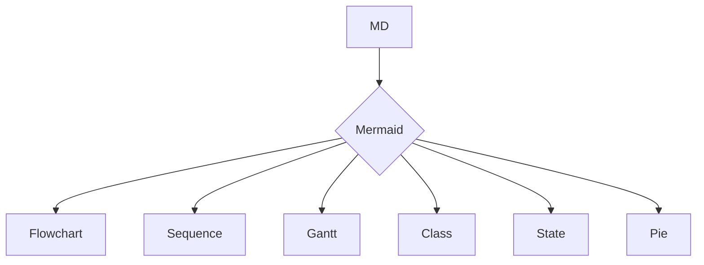
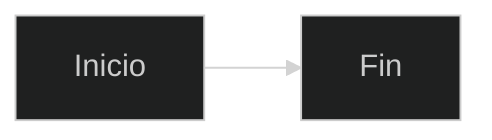
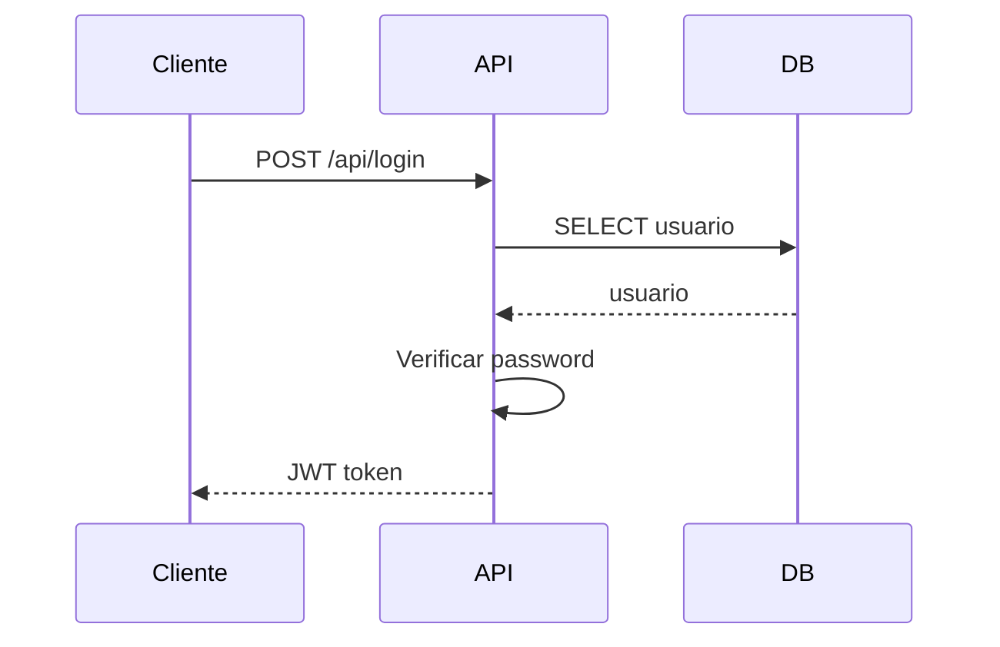
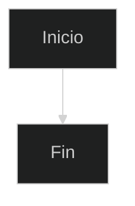

import ResponsiveImage from "@components/ResponsiveImage.astro";

# Guía de Markdown y MDX: De 0 a 100

## ¿Qué es Markdown?

Markdown es un lenguaje de marcado ligero creado por **John Gruber** (Daring Fireball) con contribuciones de **Aaron Swartz** en 2004. Su objetivo fue diseñar un formato que fuera tan legible en texto plano como en su versión renderizada. La filosofía central: **la legibilidad es lo primero**. Un archivo Markdown debe entenderse incluso antes de ser procesado.

**MDX** es la evolución que permite usar componentes JSX dentro del contenido Markdown. Creado por el equipo de mdx-js, es el estándar para frameworks modernos como Astro, Next.js y Gatsby.

**¿Dónde se usa?**
- **Documentación técnica**: README, wikis, docs de API — estándar en GitHub, GitLab, Bitbucket
- **Blogging y CMS**: Astro, Next.js, Gatsby, Ghost, Wordpress — contenido como MDX
- **Notas personales**: Obsidian, Logseq, Notion, Roam Research, Foam
- **Libros y papers**: Pandoc convierte MD a PDF, EPUB, LaTeX, DOCX
- **Mensajería**: Slack, Discord, Telegram, WhatsApp (soporte parcial)
- **Ciencia de datos**: Jupyter Notebooks con celdas Markdown, Quarto, RMarkdown
- **Presentaciones**: Slidev, Marp, reveal.js con Markdown

**¿Quién lo usa?** GitHub (todos los README/issues/discussions), Stack Overflow (preguntas y respuestas), Reddit (comentarios), Discord/Slack (mensajes), Obsidian (millones de usuarios).

**Evolución:**
- **2004**: John Gruber publica Markdown.pl, el parser original en Perl
- **2007**: GitHub empieza a renderizar README.md — explosión de adopción
- **2012**: Lanzamiento de Pandoc, el "swiss-army knife" de conversión
- **2014**: CommonMark — especificación estandarizada
- **2017**: GFM (GitHub Flavored Markdown) — tablas, tachado, task lists
- **2018**: MDX en tiempo de compilación con mdx-js/mdx
- **2020**: MDX v2 con sintaxis más estricta
- **2022**: MDX v3 con ESM-only, soporte completo de JSX
- **2024–2026**: MDX embebido en frameworks (Astro, Next.js), CMS headless con Tina CMS

🔗 [Daring Fireball — Markdown](https://daringfireball.net/projects/markdown/), [CommonMark spec](https://spec.commonmark.org/), [GitHub Flavored Markdown](https://github.github.com/gfm/), [MDX docs](https://mdxjs.com/)

---

## Prerrequisitos

Antes de empezar, necesitas:
- **Conocimientos básicos de terminal**: navegar directorios, ejecutar comandos, usar un editor de texto
- **El lenguaje/herramienta instalado** en tu sistema (sigue la sección de Instalación si aún no lo tienes)

Si no cumples algún requisito, no te preocupes: cada sección te guiará paso a paso.

## ¿Cómo empezar? Instalación en todos los entornos

### Markdown no necesita instalación

Markdown es texto plano. Cualquier editor de texto abre archivos `.md` o `.mdx`. No hay runtime, compilador ni dependencias para *escribir* Markdown.

Para *procesarlo* (convertir a HTML, PDF, etc.) sí necesitas herramientas, pero el formato en sí es cero-dependencia.

### Editores recomendados

Los IDEs y editores más usados son VSCode, JetBrains y Neovim. Extensiones y configuraciones recomendadas.

### Linux

```bash
# No necesitas instalar nada para escribir Markdown
# Para linting:
npm install -g markdownlint-cli2
# Para vista previa:
pip install grip
# Para conversión:
sudo apt install pandoc
```

### macOS

```bash
brew install pandoc
npm install -g markdownlint-cli2
pip install grip
```

### Windows

```bash
# Con winget
winget install Pandoc
npm install -g markdownlint-cli2
# WSL recomendado para herramientas Unix
```

### Docker

```dockerfile
FROM node:20-alpine
RUN npm install -g markdownlint-cli2
COPY . /docs
WORKDIR /docs
CMD ["markdownlint-cli2", "**/*.md"]
```

### Verificación

```bash
echo "# Hola Mundo" > prueba.md && cat prueba.md
pandoc --version | head -1
markdownlint-cli2 --version
```

🔗 [VS Code Markdown](https://code.visualstudio.com/docs/languages/markdown), [Obsidian help](https://help.obsidian.md/), [Pandoc installation](https://pandoc.org/installing.html)

---
## Escala de aprendizaje 0–100

Cada nivel incluye qué aprender y un proyecto para fijar los conceptos.

### Nivel 0–15: Fundamentos absolutos

**Qué aprender:**
- Sintaxis básica: `#` encabezados, `**negrita**`, `*itálica*`, `~~tachado~~`
- Párrafos y saltos de línea
- Listas: `-`, `1.`, anidadas con 2 espacios
- Enlaces: `[texto](url)`, `[texto][ref]`
- Imágenes: `<ResponsiveImage avif="/img/guia_0_100_markdown/guia_0_100_markdown_5-480.avif 480w, /img/guia_0_100_markdown/guia_0_100_markdown_5-768.avif 768w, /img/guia_0_100_markdown/guia_0_100_markdown_5-1200.avif 1200w" webp="/img/guia_0_100_markdown/guia_0_100_markdown_5-480.webp 480w, /img/guia_0_100_markdown/guia_0_100_markdown_5-768.webp 768w, /img/guia_0_100_markdown/guia_0_100_markdown_5-1200.webp 1200w" fallback="/img/guia_0_100_markdown/guia_0_100_markdown_5-1200.webp" alt="alt" blur="/9j/4AAQSkZJRgABAQAAAQABAAD/2wBDABsSFBcUERsXFhceHBsgKEIrKCUlKFE6PTBCYFVlZF9VXVtqeJmBanGQc1tdhbWGkJ6jq62rZ4C8ybqmx5moq6T/2wBDARweHigjKE4rK06kbl1upKSkpKSkpKSkpKSkpKSkpKSkpKSkpKSkpKSkpKSkpKSkpKSkpKSkpKSkpKSkpKSkpKT/wAARCAALABQDASIAAhEBAxEB/8QAHwAAAQUBAQEBAQEAAAAAAAAAAAECAwQFBgcICQoL/8QAtRAAAgEDAwIEAwUFBAQAAAF9AQIDAAQRBRIhMUEGE1FhByJxFDKBkaEII0KxwRVS0fAkM2JyggkKFhcYGRolJicoKSo0NTY3ODk6Q0RFRkdISUpTVFVWV1hZWmNkZWZnaGlqc3R1dnd4eXqDhIWGh4iJipKTlJWWl5iZmqKjpKWmp6ipqrKztLW2t7i5usLDxMXGx8jJytLT1NXW19jZ2uHi4+Tl5ufo6erx8vP09fb3+Pn6/8QAHwEAAwEBAQEBAQEBAQAAAAAAAAECAwQFBgcICQoL/8QAtREAAgECBAQDBAcFBAQAAQJ3AAECAxEEBSExBhJBUQdhcRMiMoEIFEKRobHBCSMzUvAVYnLRChYkNOEl8RcYGRomJygpKjU2Nzg5OkNERUZHSElKU1RVVldYWVpjZGVmZ2hpanN0dXZ3eHl6goOEhYaHiImKkpOUlZaXmJmaoqOkpaanqKmqsrO0tba3uLm6wsPExcbHyMnK0tPU1dbX2Nna4uPk5ebn6Onq8vP09fb3+Pn6/9oADAMBAAIRAxEAPwDBBOOtP/EGpBEmDx6d6URr6VdjJyQzOaKl2L6UU7EcyP/Z" />`
- Bloques de código: `` `inline` ``, `` ```lenguaje ``` ``
- Blockquote: `> cita`
- Líneas horizontales: `---`
- **Conceptos clave**: entiende que Markdown es texto plano. Lenguaje declarativo y de marcado, no programático. No tiene lógica, variables ni control de flujo. Su paradigma es lineal: el flujo es de arriba abajo.

**Proyecto:** *README de perfil de GitHub* — Crea un README en `username/username` con encabezados, lista de tecnologías, enlaces a proyectos, y banner.

### Nivel 15–30: Sintaxis extendida y GFM

**Qué aprender:**
- Tablas: columnas, alineación (Sección 9 — Tablas)
- Task lists: `- [ ] pendiente`, `- [x] completado`
- Footnotes: `[^1]` y `[^1]: texto`
- Emoji shortcodes: `:rocket:` → 🚀
- Autolinks: `<url>`, `correo@ejemplo.com`
- HTML embebido básico: `<details>`, `` con atributos
- **Conceptos clave**: cada procesador implementa un subconjunto distinto. GFM es el estándar de facto. CommonMark es la especificación canónica.

**Proyecto:** *Cheatsheet de Markdown* — Documento de referencia con tablas de sintaxis, task lists, footnotes, y secciones colapsables con `<details>`.

### Nivel 30–45: MDX y componentes

**Qué aprender:**
- Archivos `.mdx`: importar y usar componentes JSX/Astro/Svelte
- Frontmatter YAML y tipos de datos
- Variables en MDX: `import`/`export`, expresiones `{ }`
- Componentes personalizados por elemento (h1, p, pre, code, img)
- Layouts en Astro
- **Conceptos clave**: MDX introduce el paradigma componente-based. Los componentes envuelven elementos HTML generados por Markdown. Las expresiones permiten lógica condicional y mapas.

**Proyecto:** *Blog simple con Astro + MDX* — Layout tipográfico, componente YouTube, componente Cita, frontmatter con título/fecha/tags, listado de posts con paginación.

### Nivel 45–60: Plugins remark/rehype y testing

**Qué aprender:**
- remark plugins: `remark-gfm`, `remark-math`, `remark-directive`
- rehype plugins: `rehype-pretty-code`, `rehype-katex`, `rehype-slug`
- Plugin remark personalizado
- `unified` pipeline: parse → transform → stringify
- Linting con `markdownlint` y `Vale`
- Testing de enlaces y frontmatter (Sección 16 — Testing)
- **Conceptos clave**: el pipeline unified transforma Markdown en cualquier formato. Los plugins son funciones que reciben un AST y devuelven uno modificado.

**Proyecto:** *Documentación técnica con Mermaid + Math* — Diagramas Mermaid, ecuaciones LaTeX con KaTeX, admoniciones con remark-directive, syntax highlighting, plugin de tiempo de lectura.

### Nivel 60–75: Pandoc y conversión a múltiples formatos

**Qué aprender:**
- Pandoc: conversión MD → PDF/DOCX/EPUB/LaTeX/HTML
- Pandoc filters en Lua
- Templates de Pandoc personalizadas
- Cross-references: figuras, tablas, ecuaciones
- Bibliografía con citas: `[@autor:2006]` + archivo `.bib`

**Proyecto:** *Libro técnico con Pandoc* — 3+ capítulos en MD, combinados en PDF con xelatex, TOC, portada, bibliografía. Generar también EPUB y DOCX.

### Nivel 75–90: CMS headless y publicación automatizada

**Qué aprender:**
- Tina CMS: edición visual de MDX
- Decap CMS: admin UI para archivos .md en GitHub
- GitHub Actions: build automático (Sección 16 — CI)
- Vercel/Netlify: deploy con preview deployments
- Pagefind: búsqueda estática offline
- i18n: documentación multilingüe (Sección 17 — i18n)

**Proyecto:** *Sitio de documentación corporativa* — Astro + Tina CMS con edición visual, GitHub Actions + Vercel, búsqueda con Pagefind, i18n es/en.

### Nivel 90–100: Arquitectura de documentación y sistemas complejos

**Qué aprender:**
- Diátaxis framework: estructura completa de documentación
- ADR: documentar decisiones arquitectónicas
- OpenAPI + Markdown: documentación de API
- Docusaurus: versionado de documentación
- Obsidian como base de conocimiento corporativa
- Quarto: literate programming

**Proyecto:** *Sistema completo de documentación corporativa* — Docusaurus con versionado, ADR, runbooks, API docs con OpenAPI, tutoriales (Diátaxis), búsqueda con Algolia, linting completo (markdownlint + Vale + Prettier) en CI, i18n, Obsidian knowledge base interconectado.

🔗 [Diátaxis framework](https://diataxis.fr/), [Docusaurus docs](https://docusaurus.io/docs), [Quarto](https://quarto.org/)

---

## Primeros pasos y configuración del entorno

### El archivo `.md`

Cualquier archivo con extensión `.md` o `.markdown` es un documento Markdown:

```markdown
# Mi primer documento

Esto es un **párrafo** con *formato* básico.

- Una lista
- Con elementos
```

Guárdalo como `prueba.md`. En VS Code: `Ctrl+K V` abre la vista previa.

### Configuración de VS Code para MD/MDX

```bash
code --install-extension yzhang.markdown-all-in-one
code --install-extension davidanson.vscode-markdownlint
code --install-extension unifiedjs.vscode-mdx
code --install-extension bierner.markdown-mermaid
code --install-extension bierner.markdown-preview-github-styles
```

```jsonc
{
  "editor.wordWrap": "on",
  "[markdown]": {
    "editor.defaultFormatter": "yzhang.markdown-all-in-one",
    "editor.formatOnSave": true
  },
  "markdown.preview.breaks": true,
  "markdownlint.config": {
    "MD013": false,
    "MD033": false
  }
}
```

### Alias útiles

```bash
alias md2pdf='pandoc -s -o output.pdf'
alias md2docx='pandoc -s -o output.docx'
alias md2epub='pandoc -s -o output.epub'
alias mdlint='npx markdownlint-cli2 "**/*.md" "#node_modules"'
alias mdpreview='grip README.md'
```

### 🧪 Mini-script: verificar entorno

```bash
#!/bin/bash
echo "# Verificación" > /tmp/test.md
cat /tmp/test.md
echo "---"
if command -v pandoc &>/dev/null; then
  echo "✅ Pandoc: $(pandoc --version | head -1)"
else
  echo "❌ Pandoc no instalado"
fi
if command -v markdownlint-cli2 &>/dev/null; then
  echo "✅ markdownlint: $(markdownlint-cli2 --version)"
else
  echo "❌ markdownlint no instalado"
fi
```

🔗 [VS Code settings](https://code.visualstudio.com/docs/getstarted/settings)

---

## Sistema de archivos

### ¿Qué es?

Markdown se organiza en archivos de texto plano con extensión `.md` o `.mdx`. Un proyecto de documentación es simplemente una jerarquía de carpetas y archivos.

#### Sintaxis básica

```
proyecto/
├── README.md
├── docs/
│   ├── index.md
│   ├── guia.md
│   └── api/
│       ├── autenticacion.md
│       └── endpoints.md
├── src/
│   └── content/
│       ├── posts/
│       │   ├── post-1.md
│       │   └── post-2.md
│       └── config.ts
└── package.json
```

**Frontmatter como metadatos**: cada archivo puede llevar metadatos YAML/TOML/JSON al inicio:

```yaml
---
title: "Mi Documento"
date: 2024-01-15
tags: [markdown, tutorial]
draft: false
author:
  name: Jorge Beneyto
  email: jorge@example.com
---
```

**Globbing para colecciones**: los frameworks usan patrones glob para seleccionar archivos:

```js
const posts = defineCollection({
  loader: glob({ pattern: "**/*.{md,mdx}", base: "./src/content/posts" }),
  schema: z.object({
    title: z.string(),
    pubDate: z.date(),
    tags: z.array(z.string()),
  }),
});
```

**Obsidian como base de conocimiento interconectado**:

```markdown
# Arquitectura del sistema

- Referencia a [[ADR-001-astro]]
- Concepto relacionado: [[microservicios]]
- Tags: #arquitectura #backend #documentación
```

**Características:**
- **Backlinks**: cada archivo muestra qué otros lo referencian
- **Graph view**: visualización de conexiones entre notas
- **Dataview**: consultas tipo SQL sobre notas

```markdown
TABLE title, rating, date
FROM "projects"
WHERE status = "active"
SORT rating DESC
```

#### Static Site Generators

| Framework | Fuente de contenido | Routing |
|---|---|---|
| [**Astro**](https://astro.build/) | `src/content/**/*.md` | Basado en carpetas + slug |
| [**Next.js**](https://nextjs.org/) | `content/` o `_posts/` | `getStaticPaths` + frontmatter |
| [**Hugo**](https://gohugo.io/) | `content/` | Jerarquía de carpetas |
| [**Jekyll**](https://jekyllrb.com/) | `_posts/` con naming `YYYY-MM-DD-titulo.md` | Fecha + slug |
| **Docusaurus** | `docs/` | Jerarquía + sidebars |

**Git como sistema de versionado**: al ser texto plano, los archivos Markdown se benefician del ecosistema Git: diff, blame, branch, PR review.

#### 🧪 Cómo probarlo

```bash
# Crear estructura de prueba
mkdir -p docs/api
echo "# API Docs" > docs/api/autenticacion.md
echo "# Guía" > docs/guia.md
find docs -name "*.md" | sort

# Ver backlinks en Obsidian desde CLI (grep simple)
grep -rn "\[\[" docs/
```

#### 💡 Memoria y rendimiento

- Los archivos `.md` ocupan unos pocos KB cada uno
- El parsing es O(n) respecto al número de líneas
- Para proyectos con miles de documentos, el build puede tardar segundos-minutos
- Frameworks como Astro y Hugo compilan en paralelo

#### ✅ Buenas prácticas

- Una línea = una oración (hard wrapping)
- Nombres de archivo en `kebab-case`
- Jerarquía de carpetas plana (máximo 3 niveles)
- Frontmatter consistente en todos los archivos
- ⚠️ No mezclar tabs y espacios en YAML
- ❌ No poner archivos sueltos en `src/content/` sin organización

#### 🏗️ Metodología

- **Proyecto pequeño** (< 10 docs): un solo directorio `docs/`
- **Proyecto mediano** (< 100 docs): `docs/` con subcarpetas por categoría
- **Proyecto grande** (> 100 docs): SSG con colecciones, tags, búsqueda
- **Wiki/notas personales**: Obsidian o Foam con backlinks y graph

#### 🔗 Para saber más

- [Obsidian help — File organization](https://help.obsidian.md/Files+and+folders/Manage+files)
- [Astro content collections](https://docs.astro.build/en/guides/content-collections/)
- [Foam — File organization](https://foambubble.github.io/foam/file-organization)

---

## Conceptos clave de Markdown y MDX

Esta es la sección más pesada de la guía. Cubre cada concepto con explicación, código ejecutable, testing, buenas prácticas y enlaces externos.

### Encabezados

#### ¿Qué es?

Los encabezados estructuran el documento jerárquicamente. Van de `#` (h1) a `######` (h6). El `#` debe ir seguido de un espacio.

```markdown
# Título principal (h1)
## Sección (h2)
### Subsección (h3)
#### Sub-subsección (h4)
##### Detalle (h5)
###### Nota menor (h6)
```

**Alternativa setext** (solo h1 y h2):

```markdown
Título principal
================

Sección
-------
```

🔗 [CommonMark — Headings](https://spec.commonmark.org/0.31.2/#atx-headings)

#### 🧪 Cómo probarlo

```bash
python3 -c "
import re
md = '''# H1
## H2
### H3'''
headings = re.findall(r'^(#{1,6})\s(.+)$', md, re.MULTILINE)
for level, text in headings:
    print(f'h{len(level)}: {text}')
"
```

#### 💡 Memoria y rendimiento

- Los encabezados son solo texto — overhead insignificante
- El parser los convierte a `<h1>`...`<h6>` en O(1) por línea
- `rehype-slug` añade un `id` a cada heading para anclas

#### ✅ Buenas prácticas

- Un solo `#` por documento (el título principal)
- No saltar niveles: `# → ## → ###`, nunca `# → ###`
- Consistencia: elige ATX (`#`) o setext y manténlo
- ⚠️ No poner espacios tras `#` es error de sintaxis
- ❌ No usar `#` para enfatizar texto — es semántico

#### 🏗️ Metodología

- **README**: h1 título, h2 secciones, h3 subsecciones
- **Documentación técnica**: h1 título, h2+ para contenido
- **Posts/blog**: h1 título, h2+ secciones internas

#### 🔗 Para saber más

- [GFM — Headings](https://github.github.com/gfm/#atx-headings)
- [MDN — Heading elements](https://developer.mozilla.org/en-US/docs/Web/HTML/Element/Heading_Elements)

---

### Listas

#### ¿Qué es?

Las listas ordenadas y no ordenadas son la forma básica de agrupar elementos relacionados.

```markdown
# No ordenada
- Item 1
- Item 2
  - Subitem anidado (2 espacios)
  - Otro subitem
- Item 3

# Ordenada
1. Primer paso
2. Segundo paso
   1. Subpaso indentado
3. Tercer paso

# Mixta
1. Paso principal
   - Detalle
   - Otro detalle
2. Siguiente paso
```

🔗 [CommonMark — Lists](https://spec.commonmark.org/0.31.2/#lists)

#### 🧪 Cómo probarlo

```bash
python3 -c "
text = '''- Item 1
- Item 2
  - Subitem'''
lines = text.strip().split('\n')
for line in lines:
    indent = len(line) - len(line.lstrip())
    marker = line.strip()[0]
    print(f'indent={indent} marker={marker} text={line.strip()}')
"
```

#### 💡 Memoria y rendimiento

- Las listas anidadas aumentan la profundidad del AST
- Procesadores limitan el anidamiento (típicamente 6 niveles)
- El parser construye un árbol de nodos `list`/`listItem`

#### ✅ Buenas prácticas

- Listas no ordenadas: usa `-` consistentemente (no mezclar `*`, `+`, `-`)
- Listas ordenadas: usa `1.` siempre — Markdown renumera automáticamente
- Anidamiento: exactamente 2 espacios por nivel
- ⚠️ Línea en blanco dentro de una lista rompe el anidamiento
- ❌ No mezclar tipos en el mismo nivel

#### 🔗 Para saber más

- [GFM — Lists](https://github.github.com/gfm/#lists)

---

### Enlaces e imágenes

#### ¿Qué es?

Los enlaces conectan documentos; las imágenes insertan contenido visual.

```markdown
# Enlace básico
[texto visible](https://ejemplo.com)

# Con título
[texto](https://ejemplo.com "Título opcional")

# Referencia
[texto][ref]
[ref]: https://ejemplo.com "Título opcional"

# Enlace relativo
[README](./README.md)

# Imagen
<ResponsiveImage avif="/img/guia_0_100_markdown/guia_0_100_markdown_1-480.avif 480w, /img/guia_0_100_markdown/guia_0_100_markdown_1-768.avif 768w, /img/guia_0_100_markdown/guia_0_100_markdown_1-1200.avif 1200w" webp="/img/guia_0_100_markdown/guia_0_100_markdown_1-480.webp 480w, /img/guia_0_100_markdown/guia_0_100_markdown_1-768.webp 768w, /img/guia_0_100_markdown/guia_0_100_markdown_1-1200.webp 1200w" fallback="/img/guia_0_100_markdown/guia_0_100_markdown_1-1200.webp" alt="alt text" blur="data:image/jpeg;base64,/9j/4AAQSkZJRgA=" />

# Imagen con título
<ResponsiveImage avif="/img/guia_0_100_markdown/guia_0_100_markdown_2-480.avif 480w, /img/guia_0_100_markdown/guia_0_100_markdown_2-768.avif 768w, /img/guia_0_100_markdown/guia_0_100_markdown_2-1200.avif 1200w" webp="/img/guia_0_100_markdown/guia_0_100_markdown_2-480.webp 480w, /img/guia_0_100_markdown/guia_0_100_markdown_2-768.webp 768w, /img/guia_0_100_markdown/guia_0_100_markdown_2-1200.webp 1200w" fallback="/img/guia_0_100_markdown/guia_0_100_markdown_2-1200.webp" alt="alt" blur="data:image/jpeg;base64,/9j/4AAQSkZJRgA=" />

# Imagen como enlace
[<ResponsiveImage avif="/img/guia_0_100_markdown/guia_0_100_markdown_3-480.avif 480w, /img/guia_0_100_markdown/guia_0_100_markdown_3-768.avif 768w, /img/guia_0_100_markdown/guia_0_100_markdown_3-1200.avif 1200w" webp="/img/guia_0_100_markdown/guia_0_100_markdown_3-480.webp 480w, /img/guia_0_100_markdown/guia_0_100_markdown_3-768.webp 768w, /img/guia_0_100_markdown/guia_0_100_markdown_3-1200.webp 1200w" fallback="/img/guia_0_100_markdown/guia_0_100_markdown_3-1200.webp" alt="alt" blur="/9j/4AAQSkZJRgABAQAAAQABAAD/2wBDABsSFBcUERsXFhceHBsgKEIrKCUlKFE6PTBCYFVlZF9VXVtqeJmBanGQc1tdhbWGkJ6jq62rZ4C8ybqmx5moq6T/2wBDARweHigjKE4rK06kbl1upKSkpKSkpKSkpKSkpKSkpKSkpKSkpKSkpKSkpKSkpKSkpKSkpKSkpKSkpKSkpKSkpKT/wAARCAALABQDASIAAhEBAxEB/8QAHwAAAQUBAQEBAQEAAAAAAAAAAAECAwQFBgcICQoL/8QAtRAAAgEDAwIEAwUFBAQAAAF9AQIDAAQRBRIhMUEGE1FhByJxFDKBkaEII0KxwRVS0fAkM2JyggkKFhcYGRolJicoKSo0NTY3ODk6Q0RFRkdISUpTVFVWV1hZWmNkZWZnaGlqc3R1dnd4eXqDhIWGh4iJipKTlJWWl5iZmqKjpKWmp6ipqrKztLW2t7i5usLDxMXGx8jJytLT1NXW19jZ2uHi4+Tl5ufo6erx8vP09fb3+Pn6/8QAHwEAAwEBAQEBAQEBAQAAAAAAAAECAwQFBgcICQoL/8QAtREAAgECBAQDBAcFBAQAAQJ3AAECAxEEBSExBhJBUQdhcRMiMoEIFEKRobHBCSMzUvAVYnLRChYkNOEl8RcYGRomJygpKjU2Nzg5OkNERUZHSElKU1RVVldYWVpjZGVmZ2hpanN0dXZ3eHl6goOEhYaHiImKkpOUlZaXmJmaoqOkpaanqKmqsrO0tba3uLm6wsPExcbHyMnK0tPU1dbX2Nna4uPk5ebn6Onq8vP09fb3+Pn6/9oADAMBAAIRAxEAPwDBBOOtP/EGpBEmDx6d6URr6VdjJyQzOaKl2L6UU7EcyP/Z" />](https://ejemplo.com)
```

🔗 [CommonMark — Links](https://spec.commonmark.org/0.31.2/#links)

#### 🧪 Cómo probarlo

```bash
python3 -c "
import re
md = '[Google](https://google.com) y [GitHub][gh]\n\n[gh]: https://github.com'
links = re.findall(r'\[([^\]]+)\]\(([^)]+)\)', md)
for text, url in links:
    print(f'Link directo: {text} -> {url}')
refs = re.findall(r'^\[([^\]]+)\]:\s*(\S+)', md, re.MULTILINE)
for ref, url in refs:
    print(f'Referencia: {ref} -> {url}')
"
```

#### 💡 Memoria y rendimiento

- Las imágenes incrementan el tiempo de carga de la página
- Usa `loading="lazy"` en HTML para imágenes pesadas
- Las URLs en referencias se cachean en el AST

#### ✅ Buenas prácticas

- Alt text descriptivo en imágenes (accesibilidad + SEO)
- Texto de enlace describe el destino, no "click aquí"
- Enlaces de referencia para URLs largas o repetidas
- ⚠️ URLs rotas: verifica con `markdown-link-check`
- ❌ No usar URLs desnudas sin autolink syntax (`<url>`)

#### 🔗 Para saber más

- [GFM — Autolinks](https://github.github.com/gfm/#autolinks)
- [MDN — HTML Image element](https://developer.mozilla.org/en-US/docs/Web/HTML/Element/img)

---

### Bloques de código

#### ¿Qué es?

Los bloques de código muestran código fuente con syntax highlighting opcional.

```markdown
# Código inline
Usa la función `calcular()`

# Bloque de código sin lenguaje
```
Código sin resaltado
```

# Bloque de código con lenguaje
```python
def hola():
    print("Hola Mundo")
```

# Con nombre de archivo (HTML + CSS)
```js title="server.js"
const express = require('express');
```

# Resaltado de líneas
```python {2-3}
def hola():
    nombre = "Mundo"  # resaltado
    print(f"Hola {nombre}")  # resaltado
```
```

🔗 [GFM — Fenced code blocks](https://github.github.com/gfm/#fenced-code-blocks)

#### 🧪 Cómo probarlo

```bash
# Extraer bloques de código de un archivo MD
python3 -c "
with open('prueba.md') as f:
    content = f.read()
blocks = content.split('\`\`\`')
for i, block in enumerate(blocks):
    if i % 2 == 1:
        lang = block.split('\n')[0]
        code = '\n'.join(block.split('\n')[1:])
        print(f'Lenguaje: {lang}')
        print(f'Código: {code[:50]}...')
"
```

#### 💡 Memoria y rendimiento

- Los bloques de código se renderizan como `<pre><code>` en HTML
- `rehype-pretty-code` añade syntax highlighting con Shiki (temas oscuro/claro)
- Para docs grandes, el highlighting puede ralentizar el build
- Alternativa: highlighting en el cliente con Prism.js

#### ✅ Buenas prácticas

- Siempre especificar el lenguaje para syntax highlighting
- ` ``` ` en lugar de indentación para bloques grandes
- Línea en blanco antes y después del bloque
- ⚠️ No mezclar ` ``` ` y tablas en el mismo contexto (problemas de parsing)
- ❌ No poner espacios tras ` ``` ` inicial

#### 🔗 Para saber más

- [shiki — Syntax highlighter](https://shiki.style/)
- [rehype-pretty-code](https://rehype-pretty-code.netlify.app/)
- [Prism.js](https://prismjs.com/)

---

### Blockquotes y citas

#### ¿Qué es?

Los blockquotes representan citas textuales o contenido referenciado de otra fuente.

```markdown
> Esto es una cita.
> Puede ocupar múltiples líneas.
> Cada línea empieza con `>`.

> Cita anidada
>> Cita dentro de otra cita

> **Cita con formato**
> - Lista dentro de cita
> - Otro elemento

> [!NOTE]
> Admonition estilo Obsidian/GitHub
```

🔗 [CommonMark — Block quotes](https://spec.commonmark.org/0.31.2/#block-quotes)

#### 🧪 Cómo probarlo

```bash
python3 -c "
md = '''> Cita principal
> Continúa
>> Anidada'''
for line in md.split('\n'):
    depth = len(line) - len(line.lstrip('>'))
    content = line.lstrip('> ')
    print(f'depth={depth} content={content}')
"
```

#### ✅ Buenas prácticas

- Un `>` por línea para consistencia
- Citas cortas (< 5 líneas) para blockquotes simples
- Admonitions (`> [!NOTE]`) para notas, warnings, tips
- ⚠️ No poner blockquotes dentro de listas (problemas de parsing en algunos procesadores)

#### 🔗 Para saber más

- [GFM — Block quotes](https://github.github.com/gfm/#block-quotes)
- [Obsidian Callouts](https://help.obsidian.md/Editing+and+formatting/Callouts)

---

### Tablas (GFM)

#### ¿Qué es?

Las tablas se crean con pipes (`|`) y guiones (`-`) para la cabecera. Son una extensión GFM, no CommonMark puro.

```markdown
| Nombre   | Edad | Ciudad   |
|----------|:----:|:--------:|
| Ana      | 25   | Madrid   |
| Juan     | 30   | Barcelona|
| Luis     | 28   | Valencia |

| Alineación | Sintaxis |
|:-----------|:--------:|
| Izquierda  | `:---`   |
| Centro     | `:---:`  |
| Derecha    | `---:`   |
```

🔗 [GFM — Tables](https://github.github.com/gfm/#tables)

#### 🧪 Cómo probarlo

```bash
python3 -c "
table = '''| A | B |
|---|---|
| 1 | 2 |'''
rows = [r.strip() for r in table.split('\n') if r.strip()]
header = rows[0].split('|')[1:-1]
separator = rows[1].split('|')[1:-1]
data = [r.split('|')[1:-1] for r in rows[2:]]
print('Header:', header)
print('Separator:', separator)
print('Data:', data)
"
```

#### 💡 Memoria y rendimiento

- Las tablas grandes (+100 filas) ralentizan el parsing
- HTML tables con `colspan`/`rowspan` no son posibles en Markdown puro
- Para tablas complejas, usa HTML directamente

#### ✅ Buenas prácticas

- Alinear columnas visualmente en el código fuente
- Al menos 3 guiones en la fila separadora
- Pipe inicial y final opcional pero recomendado
- ⚠️ Celdas vacías: dejar espacio o `---`
- ❌ No usar tablas para layouts de página

#### 🔗 Para saber más

- [Tables Generator](https://www.tablesgenerator.com/markdown_tables)
- [markdown-table](https://github.com/jgm/markdown-table) — formateador

---

### YAML Frontmatter

#### ¿Qué es?

El frontmatter es un bloque de metadatos YAML/TOML/JSON al inicio del archivo, delimitado por `---`. Es el sistema de "variables" de Markdown.

```yaml
---
title: "Mi Documento"
date: 2024-01-15
tags: [markdown, tutorial]
draft: false
author:
  name: Jorge Beneyto
  email: jorge@example.com
layout: ../layouts/PostLayout.astro
---
```

**TOML:**
```toml
+++
title = "Mi Documento"
date = 2024-01-15
tags = ["markdown", "tutorial"]
+++
```

**JSON:**
```json
---
{
  "title": "Mi Documento",
  "date": "2024-01-15"
}
---
```

🔗 [YAML spec](https://yaml.org/), [Frontmatter in Astro](https://docs.astro.build/en/guides/markdown-content/#frontmatter)

#### 🧪 Cómo probarlo

```bash
python3 -c "
import yaml
content = '''---
title: Test
tags: [a, b]
---
'''
parts = content.split('---')
meta = yaml.safe_load(parts[1])
print(meta['title'])
print(meta['tags'])
"
```

#### 💡 Memoria y rendimiento

- El frontmatter se parsea en O(n) respecto al tamaño del YAML
- YAML es más lento que JSON para parsear (pero negligible para docs)
- Astro expone el frontmatter como objeto tipado con Zod

#### ✅ Buenas prácticas

- Usar YAML (estándar de facto)
- Campos obligatorios: `title`, `date`
- Tipos consistentes: `tags` siempre array, `draft` siempre booleano
- ⚠️ No usar tabs en YAML
- ❌ No poner espacios tras `---` inicial

#### 🔗 Para saber más

- [YAML multiline](https://yaml-multiline.info/)
- [Frontmatter in Static Sites](https://11ty.dev/docs/data-frontmatter/)

---

### Footnotes

#### ¿Qué es?

Las notas al pie añaden referencias sin interrumpir el flujo de lectura.

```markdown
Esto tiene una nota al pie[^1] y otra[^2].

[^1]: Texto de la primera nota.
[^2]: Texto de la segunda nota.

Las notas se renderizan al final del documento.
```

🔗 [GFM — Footnotes](https://github.blog/changelog/2021-09-30-footnotes-now-supported-in-markdown-fields/)

#### 🧪 Cómo probarlo

```bash
python3 -c "
import re
md = 'Texto[^1] mas[^2]\n\n[^1]: Primera nota\n[^2]: Segunda nota'
refs = re.findall(r'\[\^(\w+)\]', md)
defs = re.findall(r'^\[\^(\w+)\]:\s*(.+)$', md, re.MULTILINE)
print('Referencias:', refs)
print('Definiciones:', dict(defs))
"
```

#### ✅ Buenas prácticas

- IDs descriptivos: `[^nota-instalacion]` en lugar de `[^1]`
- Definir notas al final del documento
- Compatibilidad: `remark-footnotes` para procesadores sin soporte nativo

#### 🔗 Para saber más

- [remark-footnotes](https://github.com/remarkjs/remark-footnotes)

---

### Emoji shortcodes

#### ¿Qué es?

Shortcodes de emoji como `:smile:` → 😄. Soportados por GFM y `remark-emoji`.

```markdown
:rocket: :warning: :fire: :sparkles: :memo: :white_check_mark: :x:
```

🔗 [GFM emoji](https://github.com/ikatyang/emoji-cheat-sheet)

#### 🧪 Cómo probarlo

```bash
python3 -c "
import re
md = 'Hola :smile: y :rocket:'
emojis = re.findall(r':(\w+):', md)
print('Shortcodes encontrados:', emojis)
"
```

#### ✅ Buenas prácticas

- Usar emojis reales (😄) en lugar de shortcodes para mejor compatibilidad
- Los shortcodes dependen del procesador — GitHub los soporta, Pandoc no
- `remark-emoji` convierte shortcodes a emojis reales durante el build

---

### Task lists

#### ¿Qué es?

Listas de tareas con checkboxes. Extensión GFM.

```markdown
- [x] Tarea completada
- [ ] Tarea pendiente
- [ ] Otra tarea
```

En VS Code, `Alt+C` hace toggle del checkbox.

#### 🧪 Cómo probarlo

```bash
python3 -c "
md = '- [x] Hecho\n- [ ] Pendiente'
for line in md.split('\n'):
    status = '✅' if '[x]' in line else '⬜'
    text = line.replace('- [x] ', '').replace('- [ ] ', '')
    print(f'{status} {text}')
"
```

#### ✅ Buenas prácticas

- Mantener task lists cortas (ideal < 10 items)
- Usar en README para roadmap o issues tracking
- En GitHub, los checkboxes son interactivos en issues/PRs

---

### HTML embebido

#### ¿Qué es?

Markdown permite HTML inline. Útil para elementos que Markdown no soporta nativamente.

```html
<details>
  <summary>Click para expandir</summary>
  Contenido oculto hasta que el usuario haga clic.
  Puede contener **Markdown** (depende del procesador).
</details>


<figure>
  
  <figcaption>Diagrama de arquitectura</figcaption>
</figure>
```

🔗 [CommonMark — HTML blocks](https://spec.commonmark.org/0.31.2/#html-blocks)

#### ✅ Buenas prácticas

- Usar HTML solo cuando Markdown no alcance
- `<details>` para secciones colapsables
- `<figure>`+`<figcaption>` para imágenes con pie
- ⚠️ MDX: las etiquetas HTML se interpretan como JSX — cerrar siempre los tags
- ❌ No abusar del HTML — pierdes la legibilidad de Markdown

---

### MDX: componentes JSX

#### ¿Qué es?

MDX permite importar y usar componentes JSX/Astro/Svelte dentro del contenido Markdown. Es la evolución que combina la facilidad de escritura de Markdown con el poder de los componentes.

```markdown
import TablaPrecios from '../components/TablaPrecios.astro';
import YouTube from '../components/YouTube.astro';
import { formatoFecha } from '../utils';

---
title: Página con componentes
---

# {frontmatter.title}

<YouTube id="dQw4w9WgXcQ" />

<TablaPrecios plan="pro" precio={29} />
```

🔗 [MDX docs](https://mdxjs.com/)

#### Componentes personalizados por elemento

Puedes reemplazar cualquier elemento HTML que genera Markdown por tu propio componente:

| Elemento Markdown | Prop en components | Tag HTML |
|---|---|---|
| `# Heading` | `h1` | `<h1>` |
| Párrafo | `p` | `<p>` |
| `` `code` `` | `inlineCode` | `<code>` |
| ` ``` ` bloque | `pre` | `<pre><code>` |
| `<ResponsiveImage avif="/img/guia_0_100_markdown/guia_0_100_markdown_4-480.avif 480w, /img/guia_0_100_markdown/guia_0_100_markdown_4-768.avif 768w, /img/guia_0_100_markdown/guia_0_100_markdown_4-1200.avif 1200w" webp="/img/guia_0_100_markdown/guia_0_100_markdown_4-480.webp 480w, /img/guia_0_100_markdown/guia_0_100_markdown_4-768.webp 768w, /img/guia_0_100_markdown/guia_0_100_markdown_4-1200.webp 1200w" fallback="/img/guia_0_100_markdown/guia_0_100_markdown_4-1200.webp" alt="alt" blur="/9j/4AAQSkZJRgABAQAAAQABAAD/2wBDABsSFBcUERsXFhceHBsgKEIrKCUlKFE6PTBCYFVlZF9VXVtqeJmBanGQc1tdhbWGkJ6jq62rZ4C8ybqmx5moq6T/2wBDARweHigjKE4rK06kbl1upKSkpKSkpKSkpKSkpKSkpKSkpKSkpKSkpKSkpKSkpKSkpKSkpKSkpKSkpKSkpKSkpKT/wAARCAALABQDASIAAhEBAxEB/8QAHwAAAQUBAQEBAQEAAAAAAAAAAAECAwQFBgcICQoL/8QAtRAAAgEDAwIEAwUFBAQAAAF9AQIDAAQRBRIhMUEGE1FhByJxFDKBkaEII0KxwRVS0fAkM2JyggkKFhcYGRolJicoKSo0NTY3ODk6Q0RFRkdISUpTVFVWV1hZWmNkZWZnaGlqc3R1dnd4eXqDhIWGh4iJipKTlJWWl5iZmqKjpKWmp6ipqrKztLW2t7i5usLDxMXGx8jJytLT1NXW19jZ2uHi4+Tl5ufo6erx8vP09fb3+Pn6/8QAHwEAAwEBAQEBAQEBAQAAAAAAAAECAwQFBgcICQoL/8QAtREAAgECBAQDBAcFBAQAAQJ3AAECAxEEBSExBhJBUQdhcRMiMoEIFEKRobHBCSMzUvAVYnLRChYkNOEl8RcYGRomJygpKjU2Nzg5OkNERUZHSElKU1RVVldYWVpjZGVmZ2hpanN0dXZ3eHl6goOEhYaHiImKkpOUlZaXmJmaoqOkpaanqKmqsrO0tba3uLm6wsPExcbHyMnK0tPU1dbX2Nna4uPk5ebn6Onq8vP09fb3+Pn6/9oADAMBAAIRAxEAPwDBBOOtP/EGpBEmDx6d6URr6VdjJyQzOaKl2L6UU7EcyP/Z" />` | `img` | `` |
| `> quote` | `blockquote` | `<blockquote>` |

```astro
---
// CopyCode.astro
const { code } = Astro.props;
---
<pre class="relative">
  <button class="copy-btn" data-code={code}>Copiar</button>
  <slot />
</pre>
```

```markdown
import CopyCode from '../components/CopyCode.astro';

<Content components={{ pre: CopyCode }} />
```

#### 🧪 Cómo probarlo

```bash
# Verificar que MDX compila correctamente
npx mdx-check archivo.mdx
# O usar el compilador MDX directamente
node -e "
import { compile } from '@mdx-js/mdx';
const result = await compile('# Hola\n\nEsto es **MDX**.');
console.log(String(result));
"
```

#### 💡 Memoria y rendimiento

- MDX compila a JS durante el build — no hay overhead en runtime
- Componentes pesados (chart, mapas) afectan el rendimiento del build
- Astro renderiza componentes en el servidor por defecto (`client:load` para interactividad)

#### ✅ Buenas prácticas

- Importar componentes al inicio del archivo
- Usar `components={{ img: MiImg }}` para reemplazar elementos globalmente
- Componentes específicos para contenido embed (YouTube, Twitter, CodePen)
- ⚠️ No mezclar componentes dentro de sintaxis Markdown que los rompa (tablas con componentes)
- ❌ No importar componentes con side effects en el build

#### 🔗 Para saber más

- [MDX playground](https://mdxjs.com/playground/)
- [Astro MDX integration](https://docs.astro.build/en/guides/integrations-guide/mdx/)

---

### MDX: expresiones y lógica

#### ¿Qué es?

MDX permite expresiones JavaScript entre `{}` dentro del contenido, proporcionando el único control de flujo disponible en el ecosistema Markdown.

```markdown
{condition && <p>Esto se muestra si condition es true</p>}

{items.length > 0 ? (
  <ul>{items.map(item => <li key={item}>{item}</li>)}</ul>
) : (
  <p>No hay elementos</p>
)}

{items.map(item => (
  <div class="card" key={item.id}>
    <h3>{item.title}</h3>
    <p>{item.description}</p>
  </div>
))}
```

#### 🧪 Cómo probarlo

```bash
node -e "
const items = ['a', 'b', 'c'];
const result = items.map(item => item.toUpperCase());
console.log(result.join(', '));
"
```

#### ✅ Buenas prácticas

- Expresiones cortas (< 3 líneas) dentro de `{}`
- Lógica compleja → componente aparte
- Manejar el caso vacío con ternarios
- ⚠️ Encerrar strings en MDX: `${'variable'}` no confundir con template literals

#### 🔗 Para saber más

- [MDX expressions](https://mdxjs.com/docs/using-mdx/#expressions)

---

### MDX: remark y rehype plugins

#### ¿Qué es?

remark trabaja sobre el AST de Markdown (MDAST). rehype trabaja sobre el AST de HTML (HAST). Los plugins transforman el árbol antes de la renderización.

| Plugin | Función |
|---|---|
| `remark-gfm` | Añade soporte GFM: tablas, tachado, autolinks, task lists |
| `remark-math` | Parsing de LaTeX inline `$...$` y display `$$...$$` |
| `rehype-katex` | Renderiza LaTeX a HTML con KaTeX |
| `rehype-pretty-code` | Syntax highlighting con Shiki |
| `rehype-slug` | Añade `id` a los encabezados |
| `rehype-autolink-headings` | Añade enlace de ancla |
| `remark-directive` | Soporte para directivas personalizadas |
| `remark-emoji` | Convierte `:emoji:` a emoji real |
| `remark-footnotes` | Notas al pie |

**Configuración en Astro:**

```js
import { defineConfig } from 'astro/config';
import mdx from '@astrojs/mdx';
import remarkGfm from 'remark-gfm';
import remarkMath from 'remark-math';
import rehypeKatex from 'rehype-katex';
import rehypePrettyCode from 'rehype-pretty-code';
import rehypeSlug from 'rehype-slug';

export default defineConfig({
  integrations: [mdx()],
  markdown: {
    remarkPlugins: [remarkGfm, remarkMath],
    rehypePlugins: [
      rehypeSlug,
      [rehypePrettyCode, { theme: { dark: 'github-dark', light: 'github-light' } }],
      rehypeKatex,
    ],
  },
});
```

**Plugin remark personalizado:**

```js
// remark-reading-time.mjs
import { toString } from 'mdast-util-to-string';

export function remarkReadingTime() {
  return function (tree, { data }) {
    const texto = toString(tree);
    const palabras = texto.split(/\s+/).length;
    const minutos = Math.ceil(palabras / 200);
    data.astro.frontmatter.minutesRead = minutos;
  };
}
```

#### 🧪 Cómo probarlo

```bash
# Procesar MD con unified pipeline
node -e "
import { unified } from 'unified';
import remarkParse from 'remark-parse';
import remarkRehype from 'remark-rehype';
import rehypeStringify from 'rehype-stringify';

const html = await unified()
  .use(remarkParse)
  .use(remarkRehype)
  .use(rehypeStringify)
  .process('# Hola\n\nEsto es **Markdown**.');

console.log(String(html));
"
```

#### ✅ Buenas prácticas

- Orden de plugins importa: remark primero, rehype después
- Plugins oficiales > forks no mantenidos
- Medir impacto en tiempo de build (cada plugin añade overhead)
- ⚠️ Plugins incompatibles entre versiones de unified

#### 🔗 Para saber más

- [remark plugins list](https://github.com/remarkjs/remark/blob/main/doc/plugins.md)
- [rehype plugins list](https://github.com/rehypejs/rehype/blob/main/doc/plugins.md)
- [unified ecosystem](https://unifiedjs.com/)

---

## Testing y calidad

### Frameworks y herramientas

| Framework/Herramienta | Propósito | CLI | Template |
|---|---|---|---|
| **markdownlint** | Linting de sintaxis MD | `markdownlint-cli2 "**/*.md"` | [Rules](https://github.com/DavidAnson/markdownlint/blob/main/doc/Rules.md) |
| [**Prettier**](https://prettier.io/) | Formateo automático | `npx prettier --write "**/*.md"` | [Options](https://prettier.io/docs/en/options.html) |
| **Vale** | Linting de prosa y estilo | `vale README.md` | [Styles](https://vale.sh/docs/topics/styles/) |
| **remark-validate** | Testing de AST con plugins | Node.js API | [Docs](https://github.com/remarkjs/remark-validate) |
| **markdown-link-check** | Verifica enlaces rotos | `markdown-link-check README.md` | [GitHub](https://github.com/tcort/markdown-link-check) |
| **alex** | Lenguaje incluyente | `npx alex README.md` | [alexjs.com](https://alexjs.com/) |
| **MDX compiler** | Verifica sintaxis MDX | `npx mdx-check file.mdx` | [MDX](https://mdxjs.com/) |

### Cómo testear cada concepto

- **Encabezados** → `markdownlint MD001` (no saltar niveles), `MD025` (un solo h1)
- **Listas** → `MD004` (consistencia de marcadores), `MD007` (indentación)
- **Enlaces** → `markdown-link-check` para URLs rotas
- **Frontmatter** → validación con Zod/Joi del esquema YAML
- **Tablas** → `MD055` (consistencia de pipes)
- **Código** → `MD046` (consistencia de estilo de bloques)
- **Archivos** → script que verifica frontmatter, estructura de carpetas

```bash
# Linting completo de un proyecto
markdownlint-cli2 "**/*.md" "#node_modules" "#dist" "#.git"
markdown-link-check README.md
npx alex README.md
vale README.md
```

### CI con GitHub Actions

```yaml
name: Markdown Lint

on:
  push:
    paths: ['**/*.md', '**/*.mdx']

jobs:
  lint:
    runs-on: ubuntu-latest
    steps:
      - uses: actions/checkout@v4
      - uses: actions/setup-node@v4
        with:
          node-version: 20
      - run: npm ci
      - run: npx markdownlint-cli2 "**/*.{md,mdx}" "#node_modules"
      - run: npx markdown-link-check README.md
```

### 🧪 Mini-script: verificar calidad

```bash
#!/bin/bash
echo "=== Verificación de calidad Markdown ==="
errores=0

if npx markdownlint-cli2 "**/*.md" "#node_modules" 2>/dev/null; then
  echo "✅ markdownlint OK"
else
  echo "❌ markdownlint encontró errores"
  errores=$((errores+1))
fi

if command -v vale &>/dev/null; then
  echo "✅ Vale instalado"
else
  echo "⚠️ Vale no instalado (opcional)"
fi

echo "=== Total errores: $errores ==="
exit $errores
```

🔗 [markdownlint rules](https://github.com/DavidAnson/markdownlint/blob/main/doc/Rules.md), [Vale.sh](https://vale.sh/), [markdown-link-check](https://github.com/tcort/markdown-link-check)

---

## Conceptos avanzados

### Remark plugins personalizados

#### ¿Qué es?

Puedes crear tus propios plugins remark para transformar el AST de Markdown. Un plugin es una función que recibe el árbol y lo modifica.

```js
// remark-heading-anchor.mjs
import { visit } from 'unist-util-visit';

export function remarkHeadingAnchor() {
  return function (tree) {
    visit(tree, 'heading', (node) => {
      const text = node.children
        .filter(child => child.type === 'text')
        .map(child => child.value)
        .join('');
      const id = text.toLowerCase().replace(/[^\w]+/g, '-');
      node.data ||= {};
      node.data.hProperties ||= {};
      node.data.hProperties.id = id;
    });
  };
}
```

Uso:
```js
import { remarkHeadingAnchor } from './remark-heading-anchor.mjs';

export default defineConfig({
  integrations: [mdx()],
  markdown: {
    remarkPlugins: [remarkHeadingAnchor],
  },
});
```

🔗 [Remark plugin guide](https://github.com/remarkjs/remark/blob/main/doc/plugins.md#creating-plugins)

### MDX AST manipulation avanzada

#### ¿Qué es?

Puedes recorrer y modificar el MDAST/HAST para transformaciones complejas: envolver tablas en contenedores, añadir botones de copia, generar diagramas automáticos.

```js
// remark-wrap-tables.mjs
import { visit } from 'unist-util-visit';

export function remarkWrapTables() {
  return function (tree) {
    visit(tree, 'table', (node, index, parent) => {
      const wrapper = {
        type: 'paragraph',
        children: [
          { type: 'text', value: 'Tabla:' },
        ],
      };
      parent.children.splice(index, 0, wrapper);
    });
  };
}
```

🔗 [MDAST specification](https://github.com/syntax-tree/mdast)

### Pandoc filters avanzados

#### ¿Qué es?

Pandoc permite filtros en Lua que transforman el AST de Pandoc para personalizar la conversión.

```lua
-- capitalize-code.lua
function CodeBlock(block)
  block.text = block.text:upper()
  return block
end
```

```bash
pandoc documento.md --lua-filter=capitalize-code.lua -o output.html
```

Pandoc convierte MD a cualquier formato: PDF (via LaTeX), DOCX, EPUB, HTML, LaTeX, y más.

```bash
# MD → PDF profesional
pandoc README.md \
  -o README.pdf \
  --pdf-engine=xelatex \
  -V mainfont="DejaVu Sans" \
  -V fontsize=11pt \
  --toc \
  --highlight-style=tango

# Múltiples capítulos → EPUB
pandoc cap1.md cap2.md cap3.md -o libro.epub

# Documentación completa → DOCX
pandoc docs/*.md -o documentacion.docx --toc
```

🔗 [Pandoc filters guide](https://pandoc.org/filters.html), [Pandoc Lua filters](https://pandoc.org/lua-filters.html)

### Componentes MDX avanzados

#### ¿Qué es?

Componentes reutilizables para MDX que extienden las capacidades de Markdown: gráficos interactivos, mapas, diagramas, tablas dinámicas.

```mdx
import Chart from '../components/Chart.astro';
import Map from '../components/Map.astro';
import Tabs from '../components/Tabs.astro';

<Chart type="bar" data={datos} />

<Map lat={40.4168} lng={-3.7038} zoom={12} />

<Tabs tabs={["Instalación", "Configuración", "Uso"]}>
  <div slot="tab-0">Contenido instalación...</div>
  <div slot="tab-1">Contenido configuración...</div>
  <div slot="tab-2">Contenido uso...</div>
</Tabs>
```

### Mermaid avanzado: diagramas desde texto

#### ¿Qué es?

Mermaid convierte texto en diagramas vectoriales dentro de bloques de código.



Con tema oscuro:




🔗 [Mermaid docs](https://mermaid.js.org/)

### i18n para documentación

#### ¿Qué es?

Documentación multilingüe organizada por carpetas de idioma.

```
docs/
├── en/
│   ├── getting-started.md
│   └── api-reference.md
├── es/
│   ├── primeros-pasos.md
│   └── referencia-api.md
└── fr/
    ├── demarrage.md
    └── reference-api.md
```

En Astro, con content collections por idioma:
```js
const docsEn = defineCollection({
  loader: glob({ pattern: "**/*.md", base: "./src/content/en" }),
});

const docsEs = defineCollection({
  loader: glob({ pattern: "**/*.md", base: "./src/content/es" }),
});
```

🔗 [Astro i18n](https://docs.astro.build/en/guides/internationalization/)

---

## Proyecto final integrador: Sistema de blog con Astro + MDX

### Descripción

Blog personal completo con Astro + MDX que combina: sistema de archivos (colecciones de contenido), algoritmos (ordenación, filtrado, búsqueda), componentes (layouts, embeds, componentes personalizados), testing (linting de MD, validación de frontmatter, verificación de enlaces), y red (deploy automatizado a Vercel/Netlify).

### Estructura del proyecto

```
blog/
├── astro.config.mjs
├── package.json
├── src/
│   ├── content/
│   │   ├── posts/
│   │   │   ├── post-1.mdx
│   │   │   ├── post-2.mdx
│   │   │   └── config.ts
│   │   └── config.ts
│   ├── components/
│   │   ├── YouTube.astro
│   │   ├── Cita.astro
│   │   ├── CopyCode.astro
│   │   └── Chart.astro
│   ├── layouts/
│   │   └── PostLayout.astro
│   └── pages/
│       ├── index.astro
│       └── posts/
│           └── [slug].astro
├── scripts/
│   └── validate-md.mjs
└── .github/
    └── workflows/
        └── deploy.yml
```

### Paso 1: Configuración del proyecto

```bash
npm create astro@latest -- --template basics
npm install @astrojs/mdx remark-gfm rehype-slug
```

```js
// astro.config.mjs
import { defineConfig } from 'astro/config';
import mdx from '@astrojs/mdx';
import remarkGfm from 'remark-gfm';
import rehypeSlug from 'rehype-slug';
import rehypePrettyCode from 'rehype-pretty-code';

export default defineConfig({
  integrations: [mdx()],
  markdown: {
    remarkPlugins: [remarkGfm],
    rehypePlugins: [
      rehypeSlug,
      [rehypePrettyCode, { theme: { dark: 'github-dark', light: 'github-light' } }],
    ],
  },
});
```

### Paso 2: Content collection con esquema

```js
// src/content/config.ts
import { defineCollection, z } from 'astro:content';
import { glob } from 'astro/loaders';

const posts = defineCollection({
  loader: glob({ pattern: '**/*.{md,mdx}', base: './src/content/posts' }),
  schema: z.object({
    title: z.string(),
    pubDate: z.date(),
    description: z.string().optional(),
    tags: z.array(z.string()).default([]),
    draft: z.boolean().default(false),
    image: z.string().optional(),
  }),
});

export const collections = { posts };
```

### Paso 3: Componente YouTube

```astro
---
// src/components/YouTube.astro
export interface Props {
  id: string;
  title?: string;
}
const { id, title = "Video de YouTube" } = Astro.props;
---

<iframe
  width="100%"
  height="400"
  src={`https://www.youtube.com/embed/${id}`}
  title={title}
  frameborder="0"
  allow="accelerometer; autoplay; clipboard-write; encrypted-media; gyroscope; picture-in-picture"
  allowfullscreen
  loading="lazy"
></iframe>
```

### Paso 4: Plugin remark personalizado

```js
// remark-reading-time.mjs
import { toString } from 'mdast-util-to-string';

export function remarkReadingTime() {
  return function (tree, { data }) {
    const text = toString(tree);
    const words = text.split(/\s+/).length;
    const minutes = Math.ceil(words / 200);
    data.astro.frontmatter.minutesRead = minutes;
  };
}
```

### Paso 5: Script de validación

```js
// scripts/validate-md.mjs
import { glob } from 'glob';
import { execSync } from 'child_process';

const files = await glob('src/content/**/*.{md,mdx}');
console.log(`📄 Validando ${files.length} archivos...`);

// Verificar frontmatter
for (const file of files) {
  const content = await Bun.file(file).text();
  if (!content.startsWith('---')) {
    console.error(`❌ ${file}: falta frontmatter`);
    process.exit(1);
  }
}

// Linting
execSync('npx markdownlint-cli2 "src/content/**/*.{md,mdx}"', {
  stdio: 'inherit',
});

console.log('✅ Validación completa');
```

### Paso 6: CI/CD

```yaml
# .github/workflows/deploy.yml
name: Build and Deploy

on:
  push:
    branches: [main]
    paths: ['src/content/**', 'src/**']

jobs:
  quality:
    runs-on: ubuntu-latest
    steps:
      - uses: actions/checkout@v4
      - uses: actions/setup-node@v4
        with:
          node-version: 20
      - run: npm ci
      - run: node scripts/validate-md.mjs
      - run: npm run build
```

### 🧪 Verificación del proyecto

```bash
# Verificar que todo funciona
npm run build
npx pagefind --site dist

# Ver linting
npx markdownlint-cli2 "src/content/**/*.{md,mdx}"

# Ver enlaces
npx markdown-link-check "src/content/**/*.md"
```

🔗 [Astro docs](https://docs.astro.build/), [MDX docs](https://mdxjs.com/), [Pagefind docs](https://pagefind.app/)

---

## Canales y recursos en español

### YouTube

- **MoureDev** — Markdown, documentación técnica, automatización de contenido
- **HolaMundo** — Introducción a Markdown, README profesionales
- **Programación ATS** — Curso de Markdown desde cero
- **Midulive** — Flujo de trabajo con Markdown y documentación
- **Carlos Azaustre** — MDX en Next.js, Astro y Jamstack
- **Platzi** — Curso de Markdown en rutas de desarrollo web
- **Fatz** — Edición con Markdown en Obsidian

### Comunidades

- **r/Markdown** (Reddit) — Discusiones, preguntas, herramientas
- **r/ObsidianMD** (Reddit) — Comunidad de Obsidian
- **Stack Overflow en español** — Etiqueta `markdown`
- **Markdown España** (Telegram) — Grupo de usuarios

### Repositorios de código

- [mundimark/awesome-markdown](https://github.com/mundimark/awesome-markdown) — Lista curada de herramientas
- [mdx-js/mdx](https://github.com/mdx-js/mdx) — Compilador de MDX oficial
- [remarkjs/remark](https://github.com/remarkjs/remark) — Procesador con plugins
- [jgm/pandoc](https://github.com/jgm/pandoc) — Conversor universal
- [DavidAnson/markdownlint](https://github.com/DavidAnson/markdownlint) — Linter
- [mermaid-js/mermaid](https://github.com/mermaid-js/mermaid) — Diagramas desde texto
- [obsidianmd/obsidian-releases](https://github.com/obsidianmd/obsidian-releases) — Plugins de Obsidian
- [withastro/astro](https://github.com/withastro/astro) — Framework con soporte MDX
- [tina-io/tina](https://github.com/tinacms/tina) — CMS visual para MDX
- [quarto-dev/quarto-cli](https://github.com/quarto-dev/quarto-cli) — Publicación científica

### Blogs y newsletters

- [Markdown Guide](https://www.markdownguide.org/) — Guía completa de referencia
- [MDX blog](https://mdxjs.com/blog/) — Novedades del ecosistema MDX
- [Astro blog](https://astro.build/blog/) — Artículos sobre Astro + MDX
- [Daring Fireball](https://daringfireball.net/) — Blog de John Gruber
- [Pandoc blog](https://pandoc.org/blog/) — Novedades del conversor

🔗 Búsqueda en YouTube y Reddit, listas curadas de awesome-markdown, repositorios oficiales

---

## Hacks y tips de productividad

### 1. Hard wrapping para diffs limpios

```markdown
<!-- Cada línea es una oración -->
Este es un párrafo con hard wrapping.
Cada línea es una oración o frase corta.
Los diffs en git son mucho más legibles.
```

### 2. Anchor automático a encabezados

```js
import rehypeSlug from 'rehype-slug';
import rehypeAutolinkHeadings from 'rehype-autolink-headings';

// En astro.config.mjs
markdown: {
  rehypePlugins: [
    rehypeSlug,
    [rehypeAutolinkHeadings, { behavior: 'wrap' }],
  ],
}
```

### 3. Custom containers con remark-directive

```markdown
:::note{title="Nota importante"}
Esto es una nota con **Markdown** dentro.
:::

:::warning
Esto es una advertencia.
:::
```

### 4. Snippets VS Code para plantillas

Crea `.vscode/templates.code-snippets`:

```jsonc
{
  "Post MDX": {
    "scope": "markdown,mdx",
    "prefix": "mdxpost",
    "body": [
      "---",
      "layout: ../layouts/PostLayout.astro",
      "title: \"$1\"",
      "pubDate: \"${CURRENT_YEAR}-${CURRENT_MONTH}-${CURRENT_DATE}\"",
      "tags: [\"$2\"]",
      "image: "img/guia_0_100_markdown/guia_0_100_markdown_cover-1200.webp"
      "---",
      "",
      "# $1",
      "",
      "$4"
    ],
    "description": "Nuevo post MDX"
  }
}
```

### 5. Live reload de Markdown

```bash
# Con grip (Python)
pip install grip
grip README.md  # http://localhost:6419

# Con live-server (Node)
npx live-server --open=README.md --watch=.

# Con pandoc + entr (Unix)
ls *.md | entr -c pandoc -s README.md -o README.html
```

### 6. Diff highlighting en PRs

```bash
diff -u README.old.md README.new.md | pandoc -t markdown -o diff.md
```

El output se pega en un bloque de código con lenguaje `diff`.

### 7. Mermaid en modo oscuro



### 8. TOC automática con VS Code

`Ctrl+Shift+P → Markdown: Create Table of Contents`

La extensión **Markdown All in One** genera TOC automático que se actualiza al guardar.

### 9. Subíndice y superíndice en tablas

```markdown
| Fórmula | Nombre |
|---------|--------|
| `H<sub>2</sub>O` | Agua |
| `E=mc<sup>2</sup>` | Relatividad |
```

### 10. Pandoc para exportación rápida

```bash
# README → PDF profesional
pandoc README.md -o README.pdf --pdf-engine=xelatex -V mainfont="DejaVu Sans" --toc

# Blog post → EPUB
pandoc post.md -o post.epub --metadata title="Mi Post"

# Docs → DOCX
pandoc docs/*.md -o documentacion.docx --toc
```

### 11. Contenedores Docker para linting portable

```dockerfile
FROM node:20-alpine
RUN npm install -g markdownlint-cli2
COPY . /docs
WORKDIR /docs
CMD ["markdownlint-cli2", "**/*.md", "#node_modules"]
```

```bash
docker build -t md-lint .
docker run --rm -v ${PWD}:/docs md-lint
```

🔗 [remark-directive](https://github.com/remarkjs/remark-directive), [VS Code snippets](https://code.visualstudio.com/docs/editor/userdefinedsnippets), [Pandoc recipes](https://pandoc.org/recipes.html)

---

## ⚠️ Errores comunes

| Error | Causa | Solución |
|---|---|---|
| Tabla renderizada como texto plano | Falta la fila de separación con guiones (`\|---\|---\|`) justo después de la cabecera | Añade `\|---\|---\|` como segunda línea de la tabla; sin ella, CommonMark no la reconoce |
| Listas anidadas no se sangran correctamente | Se usa tabulación o se mezclan espacios con tabs | Sangra con 3 o 4 espacios desde el inicio del item padre; en GFM también funciona con 1 tab por nivel |
| Bloque de código no se cierra o se renderiza raro | Se usan 3 backticks pero el contenido contiene 3 backticks, o se olvidan los cierre | Si el código contiene triple backtick, usa 4 o más; comprueba que la cantidad de backticks de apertura y cierre sea igual |
| Imagen no aparece o muestra ruta rota | Se usa ruta relativa (`./img/foto.png`) y el procesador no la resuelve correctamente | Usa rutas relativas desde la raíz del proyecto (`/public/img/foto.png`) o rutas absolutas en MDX; verifica que el archivo exista en `/public` |
| Espacios faltantes tras `#` en encabezados | Se escribe `#Título` sin espacio, lo cual viola CommonMark | Añade un espacio después del `#`: `# Título` (excepto en ATX closed con `#` al final) |
| Emojis no se renderizan en el frontmatter | Se usan emojis en `tags` o `title` y el renderer los descarta | Envuelve el valor entre comillas simples o dobles: `title: "Guía 🚀"` |
| Link interno roto al cambiar de nombre | Se enlaza a `/posts/mi-post/` pero el slug real cambió al renombrar el archivo | Verifica los slugs con `astro build` antes de publicar; usa la herramienta de build para detectar 404s |

## 🔗 Guías relacionadas

Si quieres llevar tu contenido al siguiente nivel, estas guías te van a interesar:

- [Guía de Astro: de 0 a 100](/posts/guia-0-100-astro/) — aplica Markdown y MDX en un proyecto web real con colecciones de contenido
- [Configurar MDX y remark con IA](/posts/ia-markdown-configuracion/) — personaliza el procesamiento de Markdown con plugins y remark

---

## Referencias y documentación oficial

- **CommonMark spec**: [spec.commonmark.org](https://spec.commonmark.org/)
- **GFM spec**: [github.github.com/gfm](https://github.github.com/gfm/)
- **MDX docs**: [mdxjs.com](https://mdxjs.com/)
- **Pandoc manual**: [pandoc.org/MANUAL](https://pandoc.org/MANUAL.html)
- **Markdown Guide**: [markdownguide.org](https://www.markdownguide.org/)
- **unified ecosystem**: [unifiedjs.com](https://unifiedjs.com/)
- **Mermaid docs**: [mermaid.js.org](https://mermaid.js.org/)
- **Obsidian help**: [help.obsidian.md](https://help.obsidian.md/)
- **Astro MDX integration**: [docs.astro.build/en/guides/integrations-guide/mdx/](https://docs.astro.build/en/guides/integrations-guide/mdx/)
- **Diátaxis framework**: [diataxis.fr](https://diataxis.fr/)
- **Keep a Changelog**: [keepachangelog.com](https://keepachangelog.com/)
- **Conventional Commits**: [conventionalcommits.org](https://www.conventionalcommits.org/)
- **Tina CMS**: [tina.io/docs/](https://tina.io/docs/)
- **Docusaurus**: [docusaurus.io/docs](https://docusaurus.io/docs)
- **Pagefind**: [pagefind.app](https://pagefind.app/)
- **Quarto**: [quarto.org/docs/](https://quarto.org/docs/)
- **Vale.sh**: [vale.sh](https://vale.sh/)
- **Alex.js**: [alexjs.com](https://alexjs.com/)
- **markdownlint rules**: [github.com/DavidAnson/markdownlint](https://github.com/DavidAnson/markdownlint/blob/main/doc/Rules.md)

### Fuentes de esta guía

Esta guía se ha elaborado a partir de las siguientes fuentes:

- [CommonMark — Spec](https://spec.commonmark.org/0.31.2/)
- [GFM — GitHub Flavored Markdown Spec](https://github.github.com/gfm/)
- [MDX — Documentación oficial](https://mdxjs.com/)
- [Pandoc — Manual](https://pandoc.org/MANUAL.html)
- [Markdown Guide — Sintaxis y extensiones](https://www.markdownguide.org/)
- [awesome-markdown (GitHub)](https://github.com/mundimark/awesome-markdown)
- [remark — Plugins](https://github.com/remarkjs/remark/blob/main/doc/plugins.md)
- [rehype — Plugins](https://github.com/rehypejs/rehype/blob/main/doc/plugins.md)
- [Astro — Integración MDX](https://docs.astro.build/en/guides/integrations-guide/mdx/)
- [Tina CMS — Documentación](https://tina.io/docs/)
- [Docusaurus — Documentación](https://docusaurus.io/docs)
- [Pagefind — Documentación](https://pagefind.app/)
- [Mermaid — Documentación](https://mermaid.js.org/intro/)
- [Obsidian — Help](https://help.obsidian.md/)
- [Quarto — Documentación](https://quarto.org/docs/)
- [Diátaxis — Framework de documentación](https://diataxis.fr/)
- [Keep a Changelog](https://keepachangelog.com/)
- [r/Markdown](https://reddit.com/r/Markdown)
- [Daring Fireball — Markdown](https://daringfireball.net/projects/markdown/)
- [Wikipedia — Markdown](https://en.wikipedia.org/wiki/Markdown)
- [Programming Historian — Sustainable Authorship](https://programminghistorian.org/en/lessons/sustainable-authorship-in-plain-text-using-pandoc-and-markdown)

---

## 🏆 Retos Relacionados

Pon a prueba lo aprendido con estos desafíos:
- [Plus Reto Intermedio 13 Contador De Palabras Unicas](/retos/guia-plus-reto-intermedio-13-contador-de-palabras-unicas)
- [Plus Reto Intermedio 16 Normalizador De Titulos](/retos/guia-plus-reto-intermedio-16-normalizador-de-titulos)